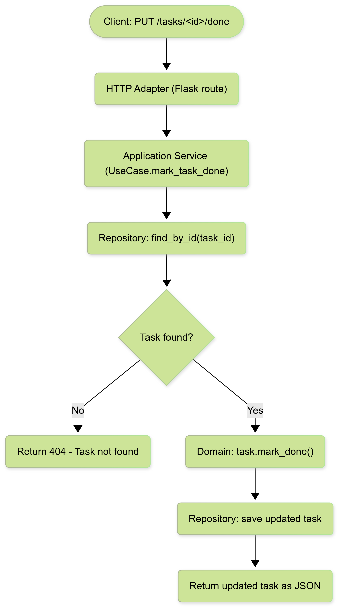

# Task Manager – Hexagonal Architecture

This service allows you to create, list, and mark tasks as completed using a hexagonal architecture (ports and adapters). Business logic is decoupled from infrastructure details, such as the web framework or storage.

## 🧱 Architecture Overview

This project follows the hexagonal (ports and adapters) architecture pattern:

- **Domain:** Entities and business logic (`Task`, use cases).
- **Application:** Use cases (`TaskUseCase`) define the application flow.
- **Adapters:** Interfaces for infrastructure (`Flask`, in-memory storage).
- **Ports:** Define interfaces between layers.

---

## 📋 Available Endpoints

### ➕ Create a task

Create a new task with a title.

```bash
curl -X POST http://localhost:5000/tasks -H "Content-Type: application/json" -d "{\"title\": \"Finish challenge\"}"

```
---

### 📄 List all tasks

Returns a list of all created tasks.

```bash
curl -X GET http://localhost:5000/tasks
```

---

### ✅ Mark task as done

Marks a task as completed (`done = true`).

```bash
curl -X PUT http://localhost:5000/tasks/<id>/done
```

📥 **Request**
- Method: `PUT`
- URL: `/tasks/<id>/done`
- Path Param: `id` – Task identifier (UUID)

📤 **Response**
```json
{
  "id": "uuid",
  "title": "Aprender arquitectura hexagonal",
  "done": true
}
```

❌ **If task is not found**
```json
{
  "error": "Task not found"
}
```

---

## 🔁 Flowchart: Mark task as completed



---

## 🧪 Example Test Flow

1. Create a task:
```bash
curl -X POST http://localhost:5000/tasks -H "Content-Type: application/json" -d "{\"title\": \"Finish challenge\"}"

```

2. Mark the task as done:
```bash
curl -X PUT http://localhost:5000/tasks/<id>/done
```

---

## 📁 Project Structure

```
Laura_Agudelo_(Zorro_Albino)/ 
    ├── adapters/
    │   ├── http_handler.py
    │   └── memory_repo.py
    ├── application/
    │   └── use_cases.py
    ├── domain/
    │   ├── entities.py
    │   └── ports.py
    ├── main.py
    ├── Flowchart.png
    └── README.md
```

---

## 🧠 Design Principles

- No business logic in adapters.
- Domain logic is testable and independent.
- Easily replace infrastructure (e.g., switch memory repo for a DB).
