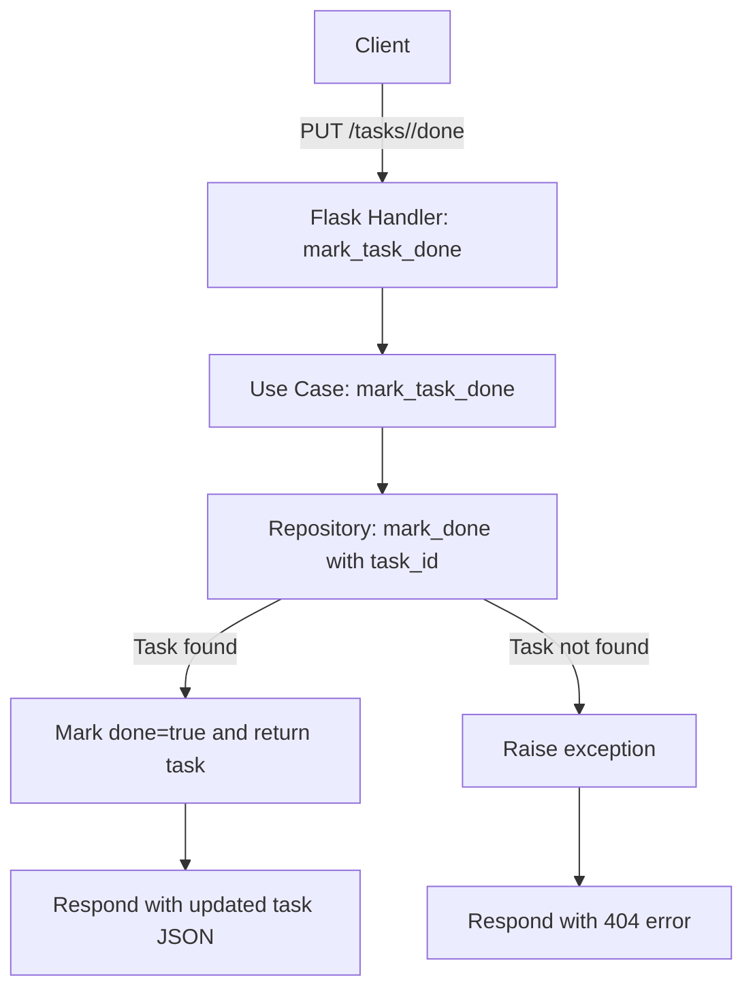

# Task Manager – Hexagonal Architecture

This service allows you to create, list, and manage tasks using a hexagonal architecture (ports and adapters). Business logic is decoupled from infrastructure details, such as the web framework or storage.

## 📋 Available Endpoints

### ➕ Create a task

Create a new task with a title.

```bash
curl -X POST http://localhost:5000/tasks \
  -H "Content-Type: application/json" \
  -d '{"title": "Aprender arquitectura hexagonal"}'


### 📄 List all tasks

Returns a list of all created tasks.

```bash
curl http://localhost:5000/tasks
```

### ✅ Mark a task as done (new feature)

Marks an existing task as completed by setting its `done` field to `true`.

**HTTP Request:**

```
PUT /tasks/<id>/done
```

Replace `<id>` with the task's unique identifier.

**Example:**

```bash
curl -X PUT http://localhost:5000/tasks/0bbaad3c-e089-4b0c-a842-139dd0d579c7/done
```

**Response:**

```json
{
  "id": "0bbaad3c-e089-4b0c-a842-139dd0d579c7",
  "title": "Aprender arquitectura hexagonal",
  "done": true
}
```

---

## 🛠️ Implementation Details

This new feature was implemented following the principles of hexagonal architecture, extending domain, application, and adapter layers without violating separation of concerns:

* **Domain Layer:**
  The `Task` entity already includes a `mark_done()` method to set `done` to `True`. No changes were required here.

* **Ports:**
  Added abstract methods `mark_task_done(task_id: str) -> Task` in `TaskInputPort` and `mark_done(task_id: str) -> Task` in `TaskOutputPort` to support marking a task as done.

* **Application Layer:**
  Added a new use case method `mark_task_done(task_id: str) -> Task` in `TaskUseCase` to mark a task as done using the repository.

* **Adapters Layer:**

  * Repository: Implemented `mark_done` in the in-memory repository.
  * HTTP Handler: Added a new route handler for `PUT /tasks/<id>/done` that calls the use case's `mark_task_done`.

---

## 🔄 Flowchart of the "Mark Task as Done" Process



---

## 📁 Project Structure

```
Pulpo/
│
├── adapters/                # Adapters layer (external interfaces)
│   ├── http_handler.py      # HTTP controller with REST endpoints
│   └── memory_repo.py       # In-memory repository (output port implementation)
│
├── application/             # Application layer (business logic / use cases)
│   └── use_cases.py         # Use case implementations (TaskUseCase)
│
├── domain/                  # Domain layer (model and ports)
│   ├── entities.py          # Entity definitions (Task)
│   └── ports.py             # Ports definitions (input/output interfaces)
│
├── main.py                  # Entry point: initializes repository, use cases, and server
│
└── README.md                # Project documentation
```
