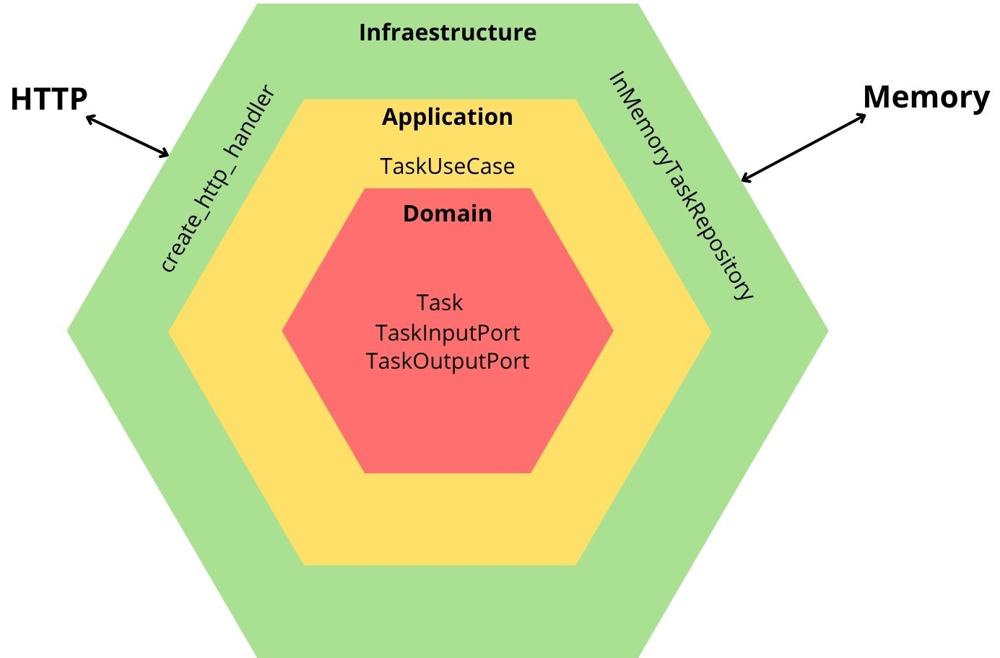
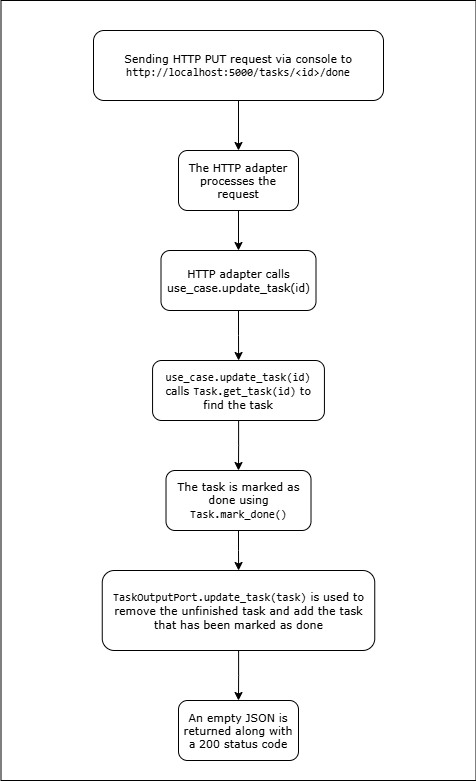

# Task Manager – Hexagonal Architecture - "Mark task as done" feature implemented

This is a new version of the task manager which includes the possibility to mark tasks as done, while preserving the Hexagonal Architecture.

## Architecture Diagram



## 📋 Endpoints available

### ➕ Create a task

Create a new task with a title.

```bash
curl -X POST http://localhost:5000/tasks \
  -H "Content-Type: application/json" \
  -d '{"title": "Aprender arquitectura hexagonal"}'
```

### 📄 List all tasks

Returns a list of all created tasks.

```bash
curl http://localhost:5000/tasks
```

### ✔️ Mark task as done

Mark a task as done by using its id.

```bash
curl -X PUT http://localhost:5000/tasks/<id>/done
```

## Flowchart of the "Mark task as done" feature


