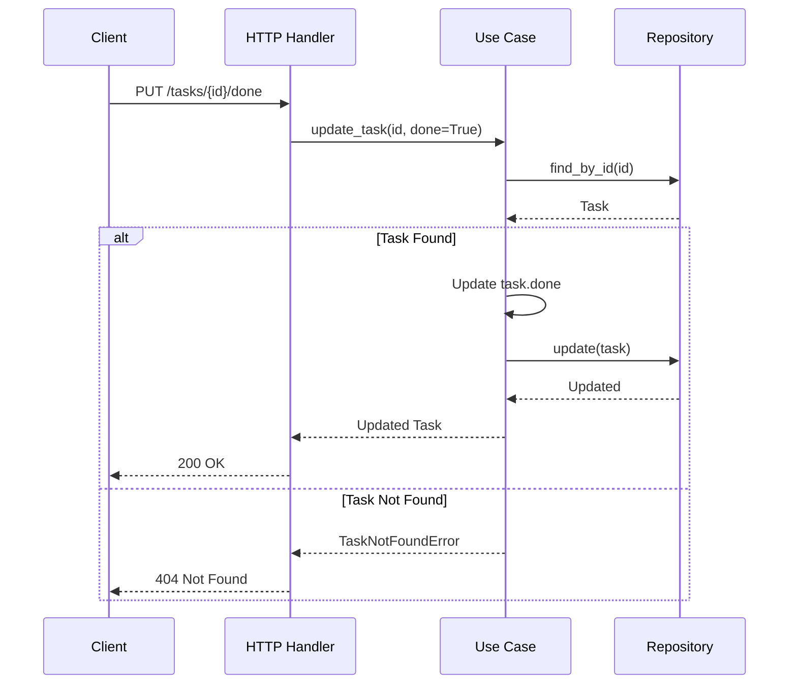

# Task Management System

## Overview
This is a task management system implemented using hexagonal architecture. The system allows creating tasks, listing all tasks, and marking tasks as done.

## Architecture
The system follows hexagonal architecture principles:
- Domain: Contains business entities and ports
- Application: Contains use cases and business logic
- Adapters: Contains HTTP handlers and repositories

## New Functionality: Mark Task as Done

### Flow Diagram

Also you can see the image in the folder [LM18h-main/Class_Activity_1/Tiburones_mariana/docs/sequence_diagram](docs/sequence_diagram.png)

## API Endpoints

### Mark Task as Done
- **URL**: `/tasks/{id}/done`
- **Method**: `PUT`
- **Description**: Marks a task as done
- **Response**:
  - 200 OK: Task updated successfully
  - 404 Not Found: Task not found
  - 500 Internal Server Error: Server error

## Implementation Details

### Domain Layer
- `Task` entity with `id`, `title`, and `done` fields
- `TaskInputPort` and `TaskOutputPort` interfaces

### Application Layer
- `TaskUseCase` implementing business logic
- `TaskNotFoundError` for handling missing tasks

### Adapter Layer
- `InMemoryTaskRepository` for data storage
- `HTTP Handler` for API endpoints

## Testing
To test the new functionality manually:
1. Create a task using POST /tasks
2. Get the task ID from the response
3. Mark the task as done using PUT /tasks/{id}/done
4. Verify the task is marked as done in the list
