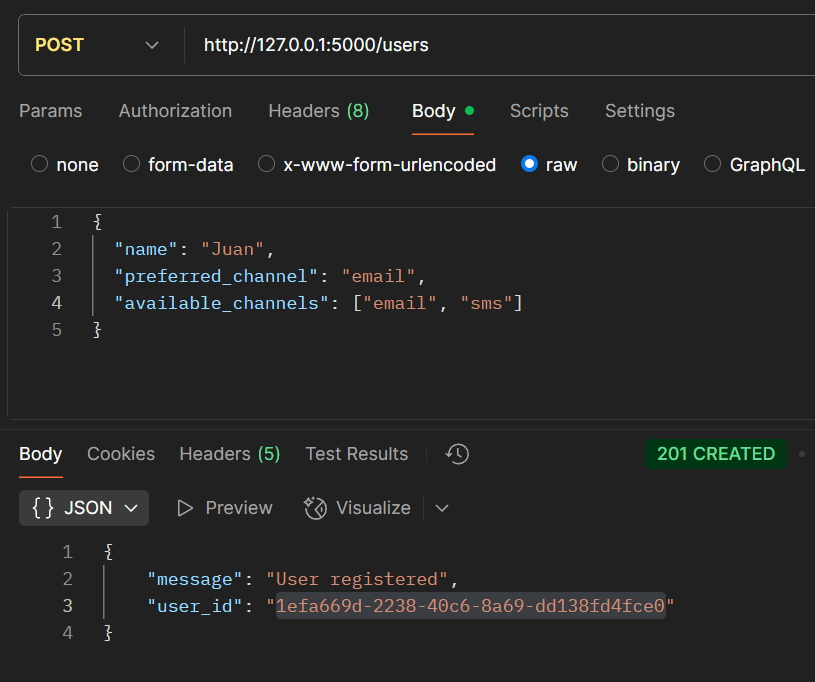
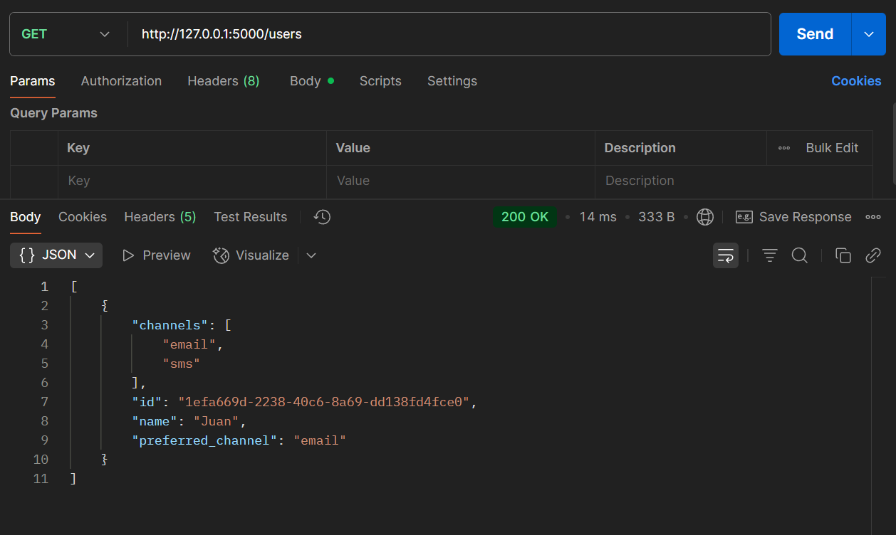
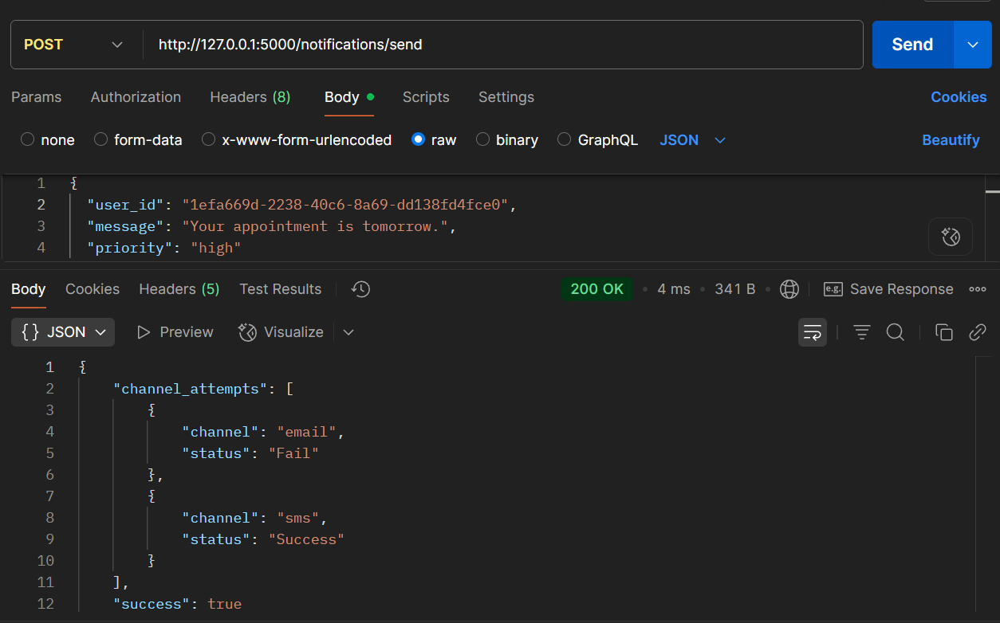
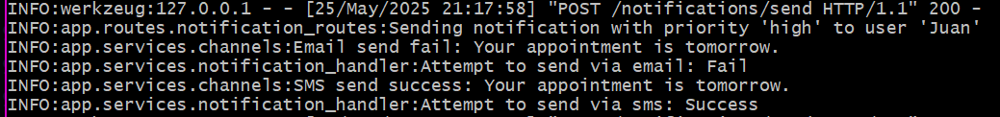
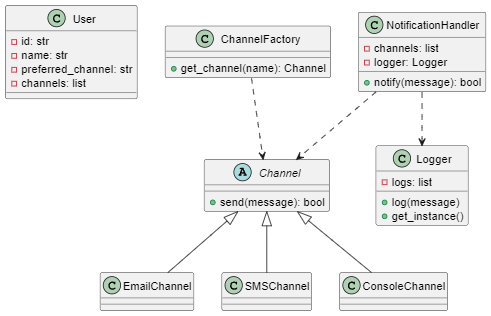

# API de Notificaciones

Este proyecto es una API RESTful construida con Flask para registrar usuarios y enviar notificaciones a través de diferentes canales (email, SMS, consola), permitiendo seleccionar el canal preferido y alternativos.

## Instalación

1. Clona el repositorio.

2. Crea y activa un entorno virtual (este es un paso opcional)
```
  python -m venv env
  En windows:
  .\env\Scripts\activate
  En Mac/Linux:
  source env/bin/activate
```
3. Instala las dependencias:
   ```
   pip install -r requirements.txt
   ```
4. Ejecuta la aplicación en la raíz del proyecto:
   ```
   flask --app app.main --debug run
   ```
5. Accede a la documentación interactiva en [http://localhost:5000/apidocs](http://localhost:5000/apidocs).

## Endpoints principales

- **POST `/users`**: Registra un nuevo usuario en el sistema.  
  Debes enviar un JSON con el nombre, canal preferido y canales disponibles. Retorna el identificador único del usuario creado.

- **GET `/users`**: Lista todos los usuarios registrados.  
  Devuelve un arreglo con los datos de cada usuario (id, nombre, canal preferido y canales disponibles).

- **POST `/notifications/send`**: Envía una notificación a un usuario específico.  
  Debes enviar un JSON con el `user_id` y el mensaje. El sistema intentará notificar al usuario usando su canal preferido y, si falla, los alternativos.
---

## Patrones de diseño aplicados

### Chain of Responsibility en `NotificationHandler`

El patrón **Chain of Responsibility** permite pasar una solicitud a través de una cadena de manejadores hasta que uno la procesa.  
En este proyecto, la clase [`NotificationHandler`](app/services/notification_handler.py) implementa este patrón al intentar enviar una notificación por una lista ordenada de canales (preferido y alternativos) hasta que uno tiene éxito.

**Ejemplo de uso en el código:**
```python
handler = NotificationHandler(['email', 'sms', 'console'])
success = handler.notify("Mensaje importante")
```
- El método `notify` recorre la lista de canales y prueba cada uno en orden.
- Si un canal logra enviar el mensaje, la cadena se detiene.
- Si todos fallan, se informa el fallo.

### Factory Method en `ChannelFactory`

El patrón **Factory Method** permite crear objetos sin especificar la clase exacta del objeto que se va a crear.  
En este proyecto, la clase [`ChannelFactory`](app/services/channel_factory.py) implementa este patrón para instanciar el canal adecuado según el nombre recibido.

**Ejemplo de uso en el código:**
```python
channel = ChannelFactory.get_channel('email')
channel.send("Mensaje")
```
- `get_channel` recibe el nombre del canal y devuelve una instancia de la clase correspondiente (`EmailChannel`, `SMSChannel`, `ConsoleChannel`).
- Gracias al patrón Factory Method, el código que utiliza la fábrica no necesita conocer ni importar directamente las clases concretas de los canales. 

---

## Estructura del proyecto

```
app/
  main.py
  models/
    user.py
  routes/
    user_routes.py
    notification_routes.py
  services/
    channel_factory.py
    channels.py
    notification_handler.py
    logger.py
img/
swagger.yaml
requirements.txt
README.md
```

## Ejemplo con Postman

### 1. POST /users


Se genera un identificador único por usuario, el cual se utiliza posteriormente en el endpoint POST /notifications/send para enviar la notificación correspondiente a ese usuario.
### 2. GET /users


### 3. POST /notifications/send


Este identificador único se utiliza para realizar la solicitud POST, y luego se muestran las notificaciones en la consola.



---

## Diagrama de clases

El siguiente diagrama muestra la estructura principal del sistema:

- **User** representa a los usuarios registrados.
- **Channel** es una clase abstracta para los canales de notificación, de la que heredan `EmailChannel`, `SMSChannel` y `ConsoleChannel`.
- **ChannelFactory** implementa el patrón Factory Method para crear instancias de canales.
- **NotificationHandler** aplica el patrón Chain of Responsibility para intentar notificar por varios canales.
- **Logger** es un singleton para el registro de logs.



## Créditos

Desarrollado por Carlos Daniel García.
