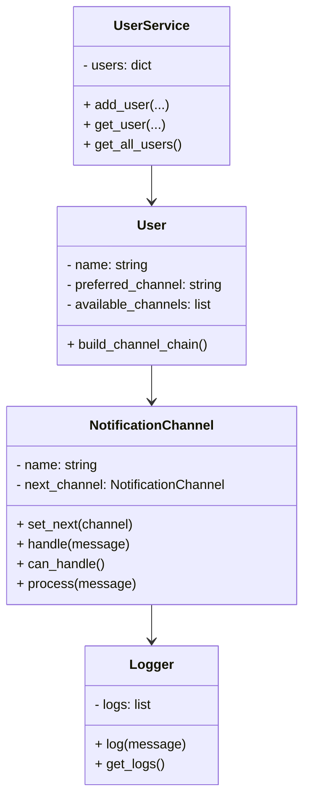

# üß™ Multichannel Notification System (REST API)

**Autor:** Santiago García Rodríguez

---

## 📝 Descripción del sistema

Este proyecto implementa un sistema REST API de envío de notificaciones multicanal utilizando Flask y dos patrones de diseño: **Chain of Responsibility** y **Singleton**. El objetivo es permitir que un usuario reciba un mensaje a través de su canal preferido y, si este falla, continuar el intento en los canales alternativos registrados.

Cada usuario se registra con:
- Un **nombre**
- Un **canal preferido** (por ejemplo, email)
- Una **lista de canales disponibles** (email, sms, consola, etc.)

Al momento de enviar una notificación, el sistema intentará entregar el mensaje en orden, simulando fallos con `random.choice([True, False])`. Cada intento se registra mediante un `Logger`.

---

## 🔁 Patrones de diseño aplicados

### 1. ‚úÖ Chain of Responsibility (Cadena de responsabilidad)
Se utiliza para encadenar los canales de envío disponibles para un usuario. Si un canal falla, el mensaje se pasa automáticamente al siguiente, sin usar estructuras de control como `if-else`.

### 2. ‚úÖ Singleton
Se utiliza en la clase `Logger`, que mantiene una única instancia compartida entre todo el sistema. Esto permite centralizar el registro de intentos de envío de mensajes.

---

## 🔌 Documentación de Endpoints

Todos los endpoints est√°n documentados autom√°ticamente en Swagger:  
üìé [http://localhost:5000/apidocs](http://localhost:5000/apidocs)

### ‚ûï POST `/users`
Registra un nuevo usuario.

#### Body:
```json
{
  "name": "Juan",
  "preferred_channel": "email",
  "available_channels": ["email", "sms", "console"]
}
````

### üîç GET `/users`

Devuelve la lista de usuarios registrados.

### ✉️ POST `/notifications/send`

Envía una notificación a un usuario.

#### Body:

```json
{
  "user_name": "Juan",
  "message": "Tu cita es mañana a las 9 a. m.",
  "priority": "high"
}
```

---

## üß± Diagrama de clases (Mermaid)


```mermaid
classDiagram
    class User {
        - name: string
        - preferred_channel: string
        - available_channels: list
        + build_channel_chain()
    }

    class NotificationChannel {
        - name: string
        - next_channel: NotificationChannel
        + set_next(channel)
        + handle(message)
        + can_handle()
        + process(message)
    }

    class Logger {
        - logs: list
        + log(message)
        + get_logs()
    }

    class UserService {
        - users: dict
        + add_user(...)
        + get_user(...)
        + get_all_users()
    }

    UserService --> User
    User --> NotificationChannel
    NotificationChannel --> Logger
```

---

## ⚙️ Instrucciones de ejecución

1. Clona el repositorio y navega a la carpeta:

   ```bash
   cd Laboratory1/1000518892/app 
   ```

2. Crea y activa un entorno virtual:

   ```bash
   python -m venv venv
   source venv/bin/activate   # Linux/Mac
   venv\Scripts\activate      # Windows
   ```

3. Instala las dependencias:

   ```bash
   cd ..
   pip install -r requirements.txt
   ```

4. Ejecuta la aplicación:

   ```bash
   python app/main.py
   ```

5. Abre la documentación interactiva:
   üëâ [http://localhost:5000/apidocs](http://localhost:5000/apidocs)

---

## üß™ Pruebas con curl

### 1. Registrar un usuario

```bash
curl -X POST http://localhost:5000/users \
  -H "Content-Type: application/json" \
  -d '{
        "name": "Juan",
        "preferred_channel": "email",
        "available_channels": ["email", "sms", "console"]
      }'
```

---

### 2. Listar usuarios

```bash
curl http://localhost:5000/users
```

---

### 3. Enviar notificación

```bash
curl -X POST http://localhost:5000/notifications/send \
  -H "Content-Type: application/json" \
  -d '{
        "user_name": "Juan",
        "message": "Tu cita es mañana",
        "priority": "alta"
      }'
```

---
