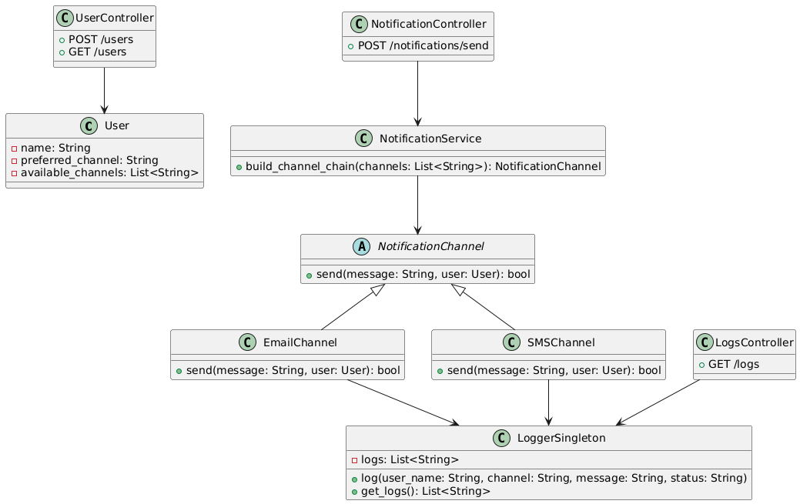

# Multichannel Notification System (REST API)

**Nombre completo:** Anderson Stick Barrera Tovar
**Documento:** 1000623506  
**Fecha:** Mayo 30, 2025  

## Descripción del sistema

Este laboratorio implementa una API REST para gestionar usuarios y enviar notificaciones a través de múltiples canales (email, SMS). Usa patrones de diseño avanzados para mantener el código modular y extensible.

- Los usuarios pueden registrarse con canales preferidos y disponibles.
- Al enviar una notificación, el sistema intenta el canal preferido primero.
- Si falla (simulado con random), se intenta el siguiente canal en cadena (Chain of Responsibility).
- Se implementa un logger centralizado (Singleton) para registrar todos los intentos.

## Endpoints

| Método | Ruta                | Descripción                           | Payload ejemplo                                  |
|--------|---------------------|-------------------------------------|-------------------------------------------------|
| POST   | /users              | Registrar un usuario                 | `{ "name": "Juan", "preferred_channel": "email", "available_channels": ["email", "sms"] }` |
| GET    | /users              | Listar todos los usuarios            | -                                               |
| POST   | /notifications/send | Enviar notificación a un usuario    | `{ "user_name": "Juan", "message": "Tu cita es mañana.", "priority": "high" }`              |

## Patrones de diseño usados

- **Chain of Responsibility:** para intentar envío en canales múltiples, pasando a siguiente si falla.
- **Singleton:** logger centralizado para registrar cada intento y resultado.

## Diagrama de clases y módulos

  


## Ejecución

1. Inicia el servidor Flask:
   ```bash
   python main.py
   ```

2. Accede a la documentación de Swagger en:  
   [http://127.0.0.1:5000/](http://127.0.0.1:5000/)

## Pruebas

### Registro de usuario
```bash
curl -X POST http://127.0.0.1:5000/users -H "Content-Type: application/json" -d '{"name": "Juan", "preferred_channel": "email", "available_channels": ["email", "sms"]}'
```

### Listar usuarios
```bash
curl -X GET http://127.0.0.1:5000/users
```

### Enviar notificación
```bash
curl -X POST http://127.0.0.1:5000/notifications/send -H "Content-Type: application/json" -d '{"user_name": "Juan", "message": "Tu cita es mañana.", "priority": "high"}'
```

## Logger

El logger centralizado registra cada intento de notificación, incluyendo el usuario, canal, mensaje y estado (éxito o fallo). Los registros se almacenan en memoria y se pueden consultar a través del endpoint `/logs`.