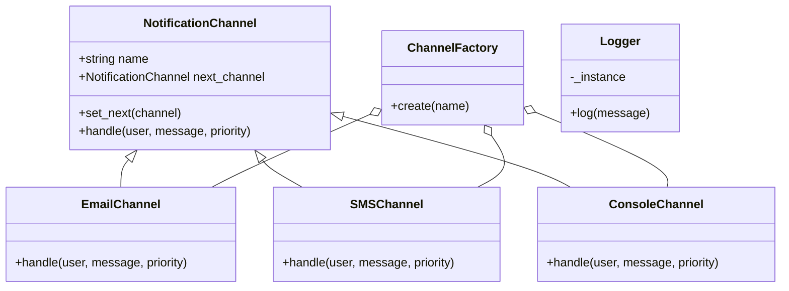

# Notification System API

**Nombre:** Julian Andres Gomez Niño

---

## Tabla de contenidos

1. [Acerca del sistema](#acerca-del-sistema)
2. [Endpoints](#endpoints)
3. [Diagrama de clases](#diagrama-de-clases)
4. [Patrones de diseño utilizados](#patrones-de-diseño-utilizados)
5. [Instrucciones de Setup & Testing](#instrucciones-de-setup--testing)
6. [Uso de Swagger](#uso-de-swagger)

---

## Acerca del sistema

Esta API RESTful permite a los usuarios registrarse en varios canales de comunicación (por ejemplo, correo electrónico, SMS, consola). Cuando se envía una notificación, el sistema intenta la entrega utilizando el canal preferido del usuario y, en caso de fallo (simulado), recurre al siguiente canal disponible, siguiendo el patrón de Cadena de Responsabilidad.

Por simplicidad, se utilizan estructuras de datos en memoria; no se requiere una base de datos externa.

---

## Endpoints

### `POST /users`

Register a new user.

**Request Body** (application/json):

```json
{
  "name": "Juan",
  "preferred_channel": "email",
  "available_channels": ["email", "sms"]
}
```

**Responses**:

* `200 OK`:

  ```json
  { "message": "User registered" }
  ```

### `GET /users`

List all registered users.

**Responses**:

* `200 OK`: Returns an array of user objects:

  ```json
  [
    { "name": "Juan", "preferred": ["email"], "available": ["email","sms"] }
  ]
  ```

### `POST /notifications/send`

Send a notification.

**Request Body** (application/json):

```json
{
  "user_name": "Juan",
  "message": "Your appointment is tomorrow.",
  "priority": "high"
}
```

**Responses**:

* `200 OK`:

  ```json
  { "status": "success", "detail": "Email sent to Juan" }
  ```

* `404 Not Found`:

  ```json
  { "error": "User not found" }
  ```

---

## Diagrama de clases



---

## Patrones de diseño utilizados

* **Singleton (Logger)**: Asegura una única instancia de logger global para centralizar todas las entradas de log sin pasar objetos logger de un lado a otro.
* **Chain of Responsibility (NotificationChannel)**: Permite la composición dinámica de una cadena de canales; cada canal intenta la entrega y pasa al siguiente en caso de fallo.
* **Factory (ChannelFactory)**: Encapsula la lógica para instanciar objetos de canal concretos, desacoplando la creación de canales de la lógica de negocio.

---

## Instrucciones de Setup & Testing

1. **Clonar el repositorio**:

   ```bash
   git clone <repo-url>
   cd 1000699110/Laboratory1
   ```

2. **Ejecutar la aplicación**:

   ```bash
   python app.py
   ```

   El servidor se ejecutará en `http://127.0.0.1:5000/`.

### Probar con `curl`

* **Registrar usuario**:

  ```bash
  curl -X POST http://127.0.0.1:5000/users \
    -H 'Content-Type: application/json' \
    -d '{"name":"Juan","preferred_channel":"email","available_channels":["email","sms"]}'
  ```

* **Listar usuarios**:

  ```bash
  curl http://127.0.0.1:5000/users
  ```

* **Enviar notificación**:

  ```bash
  curl -X POST http://127.0.0.1:5000/notifications/send \
    -H 'Content-Type: application/json' \
    -d '{"user_name":"Juan","message":"Your appointment is tomorrow.","priority":"high"}'
  ```

### Probar con Postman

1. Importar endpoints desde Swagger UI: `http://127.0.0.1:5000/apidocs/`
2. Enviar solicitudes según los ejemplos anteriores.

---

## Uso de Swagger

La API incluye documentación interactiva de Swagger a través de **Flasgger**. Después de ejecutar el servidor, navegue a:

```plaintext
http://127.0.0.1:5000/apidocs/
```
