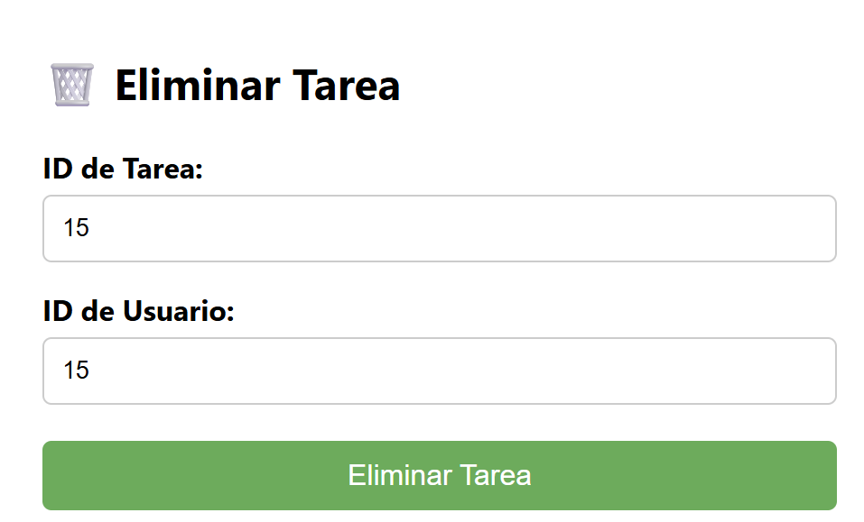
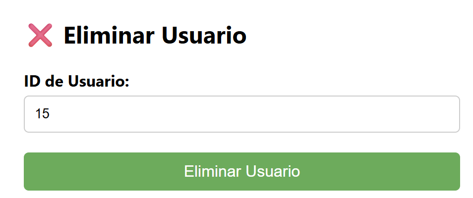

## Laboratorio de Integración

*Valentina Chicuasuque Rodriguez*

Cambios realizados despues de extender el ejemplo.

### Front-End
Le añadi dos nuevas secciones, la primera para poder eliminar una tarea, la cual le pide al usuario tanto el id de la tarea como del usuario.




La segunda seccion añadida es para eliminar el usuario, aqui solo se pide el id del usuario.



Por otro lado le hice una modificación al visualizador de tareas, en donde ahora por descripcion de tarea me da los identificadores tanto de usuario como de tarea.

### Task_Service
Aqui le añadi un endpoint para eliminar una tarea, en donde necesita tanto el id de la tarea como la del usuario, la del usuario la recibe en el body de la request.

```bash
@service_b.route('/tasks/<int:task_id>', methods=['DELETE'])
def delete_task(task_id):
    # Obtener los datos del cuerpo de la solicitud (user_id)
    data = request.get_json()
```

### User_Service
Aqui tambien solo cree un endpoint delete para eliminar un usuario segun su id
```bash
@service_a.route('/users/<int:user_id>', methods = ['DELETE'])
def delete_user(user_id):
    user =  User.query.get(user_id)
```

### TEST

### ***BackEnd-Test***

A este test tiene como objetivo probar que tanto la tarea como el usuario creado durante el test se eliminaron, para hacer esto cree 4 nuevas funciones:

1. Eliminar tarea
2. Eliminar al usuario
3. Comprobar que la tarea si fue eliminada
4. Verificar que el usuario si fue eliminado

Las comprobaciones se realizaron mediante gets en donde se buscaba si despues de eliminar se podia obtener información.

En la parte de integracion simplemente se realizaron llamados a estas funciones luego de crear las tareas y los usuarios y para el reporte se iba registrando que acción se realizo y si tuvo éxito o no.

### ***FrontEnd-Test***

A este test de manera muy similar se implementaron las funciones de eliminar una tarea y un usuario teniendo en cuentas los componentes creados en el Front-End, aqui la verificación se hacia directamente con ver_tareas() que ya estaba existente y de esa forma se puede comprobar si las eliminaciones son correctas y el reporte también registra la acción del momento y marca si esta falló o no.

### ***Utils***

Este módulo define la clase TestResult para registrar el nombre, descripción y estado (pasó o falló) de cada paso de prueba, y la función generar_reporte_pdf que consolida esos resultados en un informe PDF automático y que le va cambiando el indice para que los informes no se solapen.
Para realizar esta acción utilicé reportLab.

Los archivos PDF generados por los scripts de prueba se guardan en la carpeta tests/reports/.

Aqui se puede acceder a los reportes generados al momento de realizar el laboratorio.

Front-End : [ReporteFront-End](Test/reports/reporte_1.pdf)

Back-End : [ReporteBack-End](Test/reports/reporte_3.pdf)