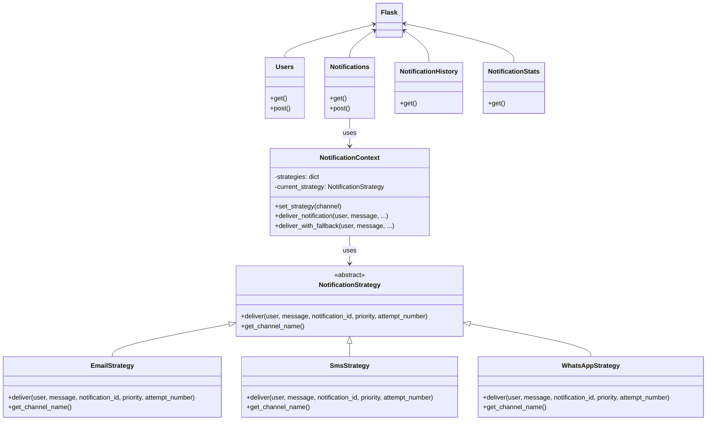

# Sistema de Notificaciones con Patrón Strategy

**Autor:** Manuel Castiblanco  
**Email:** mcastiblancoa@unal.edu.co  

## Descripción del Sistema

Este sistema implementa una API REST desarrollada con Flask que gestiona la entrega de notificaciones utilizando el patrón de diseño **Strategy**. El sistema permite registrar usuarios con sus preferencias de comunicación y enviar notificaciones con mecanismos de respaldo automático, manteniendo un historial completo de todos los intentos de entrega mediante el intercambio dinámico de estrategias.

### Características Principales

- ✅ **Gestión de usuarios** con preferencias de canales de comunicación
- 📨 **Sistema de notificaciones** con múltiples canales (Email, SMS, WhatsApp)
- 🔄 **Intercambio dinámico de estrategias** en caso de fallos
- 📊 **Historial completo** de intentos de entrega (exitosos y fallidos)
- 📈 **Estadísticas detalladas** de rendimiento por estrategia
- 📚 **Documentación Swagger** interactiva
- 🎯 **Simulación realista** de fallos para demostración
- 🔧 **Flexibilidad en tiempo de ejecución** para cambiar algoritmos de entrega

## Arquitectura y Patrones de Diseño

### Patrón Strategy

El sistema implementa el patrón Strategy para manejar la entrega de notificaciones mediante estrategias intercambiables:

```
NotificationContext
├── EmailStrategy
├── SmsStrategy
└── WhatsAppStrategy
```

#### Justificación del Patrón

1. **Intercambio de algoritmos**: Permite cambiar dinámicamente el algoritmo de entrega sin modificar el código cliente
2. **Flexibilidad en tiempo de ejecución**: El contexto puede cambiar de estrategia basándose en condiciones específicas
3. **Facilidad de extensión**: Agregar nuevas estrategias de entrega es simple y no afecta el código existente
4. **Eliminación de condicionales**: Evita largas estructuras if-else para seleccionar el método de entrega
5. **Reutilización**: Las estrategias pueden ser reutilizadas en diferentes contextos
6. **Testabilidad**: Cada estrategia puede ser probada independientemente

### Diagrama de Clases/Módulos



### Estructura del Proyecto

```
strategy/
├── api.py                # Código fuente principal
├── README.md             # Este archivo
└── requirements.txt      # Dependencias
```

## Documentación de Endpoints

### Base URL
```
http://localhost:5000
```

### 1. Gestión de Usuarios

#### `GET /users/`
Obtiene todos los usuarios registrados.

**Respuesta:**
```json
[
  {
    "id": 1,
    "name": "Juan Pérez",
    "preferred_channel": "email",
    "available_channels": ["email", "sms", "whatsapp"]
  }
]
```

#### `POST /users/`
Crea un nuevo usuario con estrategias de comunicación disponibles.

**Cuerpo de la petición:**
```json
{
  "name": "María García",
  "preferred_channel": "email",
  "available_channels": ["email", "sms", "whatsapp"]
}
```

### 2. Sistema de Notificaciones

#### `GET /notifications/send`
Obtiene todas las notificaciones enviadas usando las diferentes estrategias.

#### `POST /notifications/send`
Envía una notificación a un usuario utilizando el patrón Strategy.

**Cuerpo de la petición:**
```json
{
  "user_name": "María García",
  "message": "Su pedido ha sido enviado",
  "priority": "medium"
}
```

**Valores válidos para priority:** `high`, `medium`, `low`

**Proceso interno:**
1. El `NotificationContext` selecciona la estrategia preferida del usuario
2. Si la estrategia falla, cambia automáticamente a las estrategias de respaldo
3. Cada cambio de estrategia se registra en el historial

### 3. Historial de Notificaciones

#### `GET /notifications/history`
Obtiene el historial completo de intentos de entrega con detalles de cada estrategia utilizada.

**Respuesta:**
```json
[
  {
    "id": 1,
    "notification_id": 1,
    "user_name": "Juan Pérez",
    "message": "Su pedido ha sido enviado",
    "priority": "medium",
    "channel": "email",
    "success": false,
    "timestamp": "2025-05-25T10:30:00",
    "attempt_number": 1
  },
  {
    "id": 2,
    "notification_id": 1,
    "user_name": "Juan Pérez",
    "message": "Su pedido ha sido enviado",
    "priority": "medium",
    "channel": "sms",
    "success": true,
    "timestamp": "2025-05-25T10:30:05",
    "attempt_number": 2
  }
]
```

### 4. Estadísticas

#### `GET /notifications/stats`
Obtiene estadísticas de rendimiento del sistema con análisis por estrategia.

**Respuesta:**
```json
{
  "total_notifications": 10,
  "successful_notifications": 8,
  "failed_notifications": 2,
  "success_rate": 80.0,
  "strategy_stats": {
    "email": {
      "total_attempts": 8,
      "successful_attempts": 4,
      "success_rate": 50.0,
      "failed_attempts": 4
    },
    "sms": {
      "total_attempts": 5,
      "successful_attempts": 3,
      "success_rate": 60.0,
      "failed_attempts": 2
    },
    "whatsapp": {
      "total_attempts": 2,
      "successful_attempts": 1,
      "success_rate": 50.0,
      "failed_attempts": 1
    }
  },
  "total_attempts": 15,
  "average_attempts_per_notification": 1.5,
  "pattern_type": "Strategy Pattern"
}
```

## Instalación y Configuración

### Requisitos Previos
- Python 3.7 o superior
- pip (gestor de paquetes de Python)

### Instalación

1. **Obtener el código:**
```bash
# Crear directorio del proyecto
mkdir notification-strategy-api
cd notification-strategy-api

# Copiar el archivo paste.txt como api.py
cp paste.txt api.py
```

2. **Instalar dependencias:**
```bash
pip install flask flask-restful flasgger
```

3. **Ejecutar la aplicación:**
```bash
python api.py
```

4. **Acceder a la documentación:**
- Swagger UI: http://localhost:5000/swagger/
- API Principal: http://localhost:5000/

## Ejemplos de Uso

### Usando cURL

#### 1. Crear un usuario con estrategias disponibles
```bash
curl -X POST "http://localhost:5000/users/" \
-H "Content-Type: application/json" \
-d '{
  "name": "Ana López",
  "preferred_channel": "email",
  "available_channels": ["email", "sms", "whatsapp"]
}'
```

#### 2. Enviar una notificación (activará el patrón Strategy)
```bash
curl -X POST "http://localhost:5000/notifications/send" \
-H "Content-Type: application/json" \
-d '{
  "user_name": "Ana López",
  "message": "Bienvenida al sistema",
  "priority": "high"
}'
```

#### 3. Ver historial de estrategias utilizadas
```bash
curl -X GET "http://localhost:5000/notifications/history"
```

#### 4. Ver estadísticas por estrategia
```bash
curl -X GET "http://localhost:5000/notifications/stats"
```

### Usando Postman

#### Configuración Base
1. **Base URL:** `http://localhost:5000`
2. **Headers:** `Content-Type: application/json`

#### Colección de Pruebas

**1. Crear Usuario con Múltiples Estrategias**
- **Método:** POST
- **URL:** `/users/`
- **Body (JSON):**
```json
{
  "name": "Carlos Mendoza",
  "preferred_channel": "sms",
  "available_channels": ["email", "sms", "whatsapp"]
}
```

**2. Listar Usuarios**
- **Método:** GET
- **URL:** `/users/`

**3. Enviar Notificación (Demostrará Strategy Pattern)**
- **Método:** POST
- **URL:** `/notifications/send`
- **Body (JSON):**
```json
{
  "user_name": "Carlos Mendoza",
  "message": "Recordatorio de pago",
  "priority": "high"
}
```

**4. Ver Historial de Estrategias**
- **Método:** GET
- **URL:** `/notifications/history`

**5. Ver Estadísticas por Estrategia**
- **Método:** GET
- **URL:** `/notifications/stats`

## Flujo de Funcionamiento

### Proceso de Entrega usando Strategy Pattern

1. **Recepción de solicitud** de envío de notificación
2. **Búsqueda del usuario** por nombre
3. **Inicialización del contexto** NotificationContext
4. **Aplicación del patrón Strategy**:
   - Se crea lista de estrategias a intentar (preferida primero)
   - Para cada estrategia:
     - El contexto **establece la estrategia** (`set_strategy()`)
     - **Ejecuta la estrategia** (`deliver_notification()`)
     - **Registra el intento** en el historial
     - Si falla, **cambia a la siguiente estrategia**
5. **Finalización**:
   - Éxito: Se registra qué estrategia fue exitosa
   - Fallo: Se registra que todas las estrategias fallaron

### Ejemplo de Flujo con Strategy Pattern

```
Usuario: Juan (preferido: email, disponible: [email, sms, whatsapp])
Mensaje: "Confirmación de pedido"

NotificationContext inicializado
├── Estrategias disponibles: {email: EmailStrategy, sms: SmsStrategy, whatsapp: WhatsAppStrategy}

Intento 1: Cambiar a EmailStrategy
├── context.set_strategy("email")
├── EmailStrategy.deliver() ejecutada
├── Resultado: FALLO
└── Registra: attempt #1, email, failed

Intento 2: Cambiar a SmsStrategy
├── context.set_strategy("sms")  
├── SmsStrategy.deliver() ejecutada
├── Resultado: ÉXITO
├── Registra: attempt #2, sms, success
└── FINALIZA: Notificación entregada via SmsStrategy
```

## Ventajas del Patrón Strategy en este Contexto

### 1. **Flexibilidad de Algoritmos**
- Cada estrategia encapsula un algoritmo de entrega diferente
- El contexto puede cambiar de estrategia dinámicamente
- Fácil agregar nuevas estrategias sin modificar código existente

### 2. **Mantenibilidad**
- Cada estrategia es independiente y fácil de mantener
- Los cambios en una estrategia no afectan a las demás
- Código más limpio sin estructuras condicionales complejas

### 3. **Testabilidad**
- Cada estrategia puede ser probada de forma aislada
- El contexto puede usar estrategias mock para pruebas
- Facilita pruebas unitarias específicas por canal

### 4. **Extensibilidad**
- Agregar nuevos canales (Telegram, Discord, etc.) es trivial
- Solo requiere implementar la interfaz `NotificationStrategy`
- No necesita modificar el código del contexto

## Características Técnicas

### Almacenamiento de Datos
- **En memoria**: Todas las estructuras de datos se almacenan en listas Python

### Configuración de Estrategias

```python
# El contexto mantiene un diccionario de estrategias disponibles
self.strategies = {
    'email': EmailStrategy(),
    'sms': SmsStrategy(),
    'whatsapp': WhatsAppStrategy()
}
```