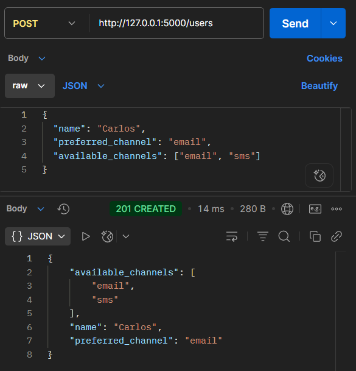

# Laboratory 1 - Multichannel Notification System

### **Author:** Adrian Ramirez Gonzalez

## 💻 System explanation

This is a REST API built with Flask that lets you create users and send notifications using different channels (SMS, email and console).

## 🧩 Design patterns

Two design patterns were used in the application. These patterns are:

### 🔗 Chain of responsibility

This design pattern was used to handle the different channels a user can specify to receive a notification. This chain always tries the user's preferred channel first, and if it doesn't work, it proceeds to try the other available channels. This pattern was very useful because it allows defining a specific channel order for each user.

### 🧍 Singleton

The Singleton pattern was used to create a Logger class with a single instance that records all the notification attempts. This was useful for successfully storing all logs generated by the channel handlers.

## Class diagram


## 🚀 Run the API

To run the API, you need to install Flask and Flasgger. You can do this by running the following command:

```bash
pip install Flask flasgger
```

After installation, you can run the API by running the following command:

```bash
python app.py
```

The app will run on http://127.0.0.1:5000

Also, you will find the swagger documentation at http://127.0.0.1:5000/apidocs/

## 🔌 Endpoints

### 🆕 POST /users

Creates a new user

#### Request body

```json
{
  "name": "Carlos",
  "preferred_channel": "email",
  "available_channels": ["email", "sms"]
}
```

#### Response example

```json
{
  "available_channels": ["email", "sms"],
  "name": "Carlos",
  "preferred_channel": "email"
}
```

Status code: ✅ 201

### 📋 GET /users

Get the list of registered users

#### Response example

```json
[
  {
    "available_channels": ["email", "sms"],
    "name": "Juan",
    "preferred_channel": "email"
  },
  {
    "available_channels": ["email", "sms"],
    "name": "Diego",
    "preferred_channel": "sms"
  }
]
```

Status code: ✅ 200

### ✉️ POST /notifications/send

Sends a notification to a user through their available channels (it first tries the preferred channel).

#### Request body

```json
{
  "user_name": "Juan",
  "message": "Hi!",
  "priority": "low"
}
```

#### Response examples

##### Notification sent

```json
{ "message": "The notification was sent" }
```

Status code: ✅ 200

##### User not found

```json
{ "error": "The user doesn't exist" }
```

Status code: ❌ 400

##### None of the channels worked

```json
{ "error": "The notification can't be sent" }
```

Status code: ❌ 400

### 📜 GET /notifications

Returns the history of notification attempts.

#### Response example

```json
[
  {
    "channel": "email",
    "message": "Hi!",
    "priority": "low",
    "status": "failed",
    "user_name": "Juan"
  },
  {
    "channel": "sms",
    "message": "Hi!",
    "priority": "low",
    "status": "completed",
    "user_name": "Juan"
  }
]
```

Status code: ✅ 200

## 🛠️ POSTMAN examples

### 🆕 POST /users

- **Method:** POST
- **URL:** http://127.0.0.1:5000/users
- **Body (raw JSON):**

```json
{
  "name": "Carlos",
  "preferred_channel": "email",
  "available_channels": ["email", "sms"]
}
```

#### POSTMAN request and response



### 📋 GET /users

- **Method:** GET
- **URL:** http://127.0.0.1:5000/users

#### POSTMAN request and response


### ✉️ POST /notifications/send

- **Method:** POST
- **URL:** http://127.0.0.1:5000/notifications/send
- **Body (raw JSON):**

```json
{
  "user_name": "Juan",
  "message": "Hi!",
  "priority": "low"
}
```

#### POSTMAN request and response


Also, you could get a error message if none of the channel works


### 📜 GET /notifications

- **Method:** GET
- **URL:** http://127.0.0.1:5000/notifications
- **Body (raw JSON):**

#### POSTMAN request and response

**Note:** Send a notification first to generate log entries


