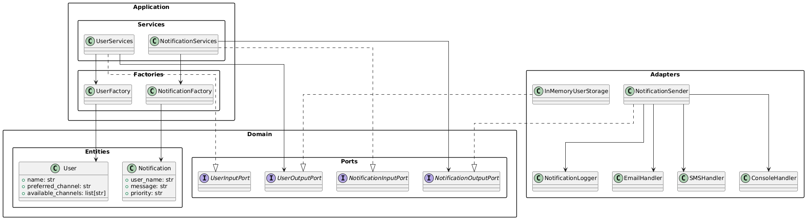

# Laboratory 1 - Multichannel Notification System (REST API)

## Author: Sebastián Moreno

### Overview
This system implements a multichannel notification service using Flask, which allows sending notifications to users via various channels (email, SMS, or console). It supports handling channel failures with retries and logs all notification attempts. The project uses design patterns such as **Chain of Responsibility**, **Singleton**, and **Factory** to ensure scalability and maintainability. The system is structured using **Hexagonal Architecture**, isolating core business logic from external systems for better modularity and testability.

---

### **System Explanation**
This notification system consists of several components:
1. **User Registration**: Users are registered with their preferred notification channel and a list of available channels.
2. **Notification Sending**: Notifications can be sent through multiple channels. If one channel fails, the system tries another channel in the order of available channels.
3. **Notification Logging**: Each notification attempt (success or failure) is logged.
4. **Error Handling**: If all channels fail to deliver a notification, an error response is returned.

---

### **Class/Module Diagram**

The following diagram illustrates the structure of the system following the principles of Hexagonal Architecture. It shows the relationships between entities, ports, services, factories, and adapters:



---

### **API Endpoints**

#### **1. Register a New User**
- **URL**: `/users`
- **Method**: `POST`
- **Request Body**:
    ```json
    {
        "name": "Alice",
        "preferred_channel": "email",
        "available_channels": ["sms", "email"]
    }
    ```
- **Response**:
    - **Status Code**: `201 Created`
    - **Response Body**:
      ```json
      {
          "name": "Alice",
          "preferred_channel": "email",
          "available_channels": ["sms", "email"]
      }
      ```
- **Error Response**:
    - **Status Code**: `400 Bad Request`
    - **Response Body**:
      ```json
      {
          "error": "User 'Alice' already exists."
      }
      ```
    - **Status Code**: `400 Bad Request`
    - **Response Body**:
      ```json
      {
          "error": "Preferred channel must be in the list of available channels."
      }
      ```

#### **2. List All Users**
- **URL**: `/users`
- **Method**: `GET`
- **Response**:
    - **Status Code**: `200 OK`
    - **Response Body**:
      ```json
      [
          {
              "name": "Alice",
              "preferred_channel": "email",
              "available_channels": ["sms", "email"]
          }
      ]
      ```

#### **3. Send a Notification**
- **URL**: `/notifications/send`
- **Method**: `POST`
- **Request Body**:
    ```json
    {
        "user_name": "Alice",
        "message": "Your package has been shipped.",
        "priority": "High"
    }
    ```
- **Response**:
    - **Status Code**: `200 OK`
    - **Response Body**:
      ```json
      {
          "status": "success",
          "data": {
              "user_name": "Alice",
              "message": "Your package has been shipped.",
              "priority": "High",
              "channel_used": "email"
          },
          "details": "Notification delivered successfully."
      }
      ```
    - **Error Response**:
      - **Status Code**: `400 Bad Request`
      - **Response Body**:
        ```json
        {
            "error": "User 'Bob' does not exist."
        }
        ```
      - **Status Code**: `503 Service Unavailable`
      - **Response Body**:
        ```json
        {
            "status": "error",
            "data": {
                "user_name": "Alice",
                "message": "Your package has been shipped.",
                "priority": "High"
            },
            "details": "All delivery attempts failed."
        }
        ```

#### **4. Get Logs of All Notification Attempts**
- **URL**: `/logs`
- **Method**: `GET`
- **Response**:
    - **Status Code**: `200 OK`
    - **Response Body**:
      ```json
      [
          {
              "timestamp": "2025-05-30 14:32:15",
              "channel": "email",
              "user": "Alice",
              "message": "Your package has been shipped.",
              "priority": "High",
              "success": true
          }
      ]
      ```

---

### **Design Patterns Justifications**

#### **1. Chain of Responsibility**
The notification sending process is handled using the **Chain of Responsibility** pattern. Each channel (Email, SMS, Console) is represented by a handler. If one channel fails to deliver the notification, the system attempts the next channel in the chain, until a successful delivery or all channels fail.

#### **2. Singleton**
The **Singleton** pattern is applied in the `NotificationLogger` class. This ensures that there is only one instance of the logger that manages and records all notification attempts, thus providing a centralized logging mechanism across the system.

#### **3. Factory**
The **Factory** pattern is used in two key areas of the system:
- **UserFactory**: A factory that creates and registers user objects. It abstracts the logic of creating user objects and helps manage user-related information such as preferred and available channels.
- **NotificationFactory**: This factory creates instances of different notification channel handlers (e.g., Email, SMS, or Console). The factory abstracts the creation logic, allowing the system to instantiate the appropriate handler based on the user’s available channels. This provides flexibility for adding new notification channels in the future without modifying the core logic.

---

### **Setup and Testing Instructions**

#### **1. Setup Instructions**
1. Clone the repository:
    ```bash
    git clone https://github.com/SwEng2-2025i/LM18h/tree/main/laboratories/laboratory_1/10000461014
    ```
2. Install dependencies:
    ```bash
    pip install -r requirements.txt
    ```
3. Run the Flask application:
    ```bash
    python main.py
    ```

#### **2. Testing Instructions**

##### **Using `curl`**

- **Register a User**:
    ```bash
    curl -X POST -H "Content-Type: application/json" -d '{"name": "Alice", "preferred_channel": "email", "available_channels": ["sms", "email"]}' http://localhost:5000/users
    ```

- **Get Users**:
    ```bash
    curl http://localhost:5000/users
    ```

- **Send a Notification**:
    ```bash
    curl -X POST -H "Content-Type: application/json" -d '{"user_name": "Alice", "message": "Your package has been shipped.", "priority": "High"}' http://localhost:5000/notifications/send
    ```

- **Get Logs**:
    ```bash
    curl http://localhost:5000/logs
    ```

---
### **Swagger Documentation**
You can access the Swagger API documentation at the following URL after running the application: 

http://localhost:5000/apidocs

This will provide interactive documentation for all the available API endpoints.

