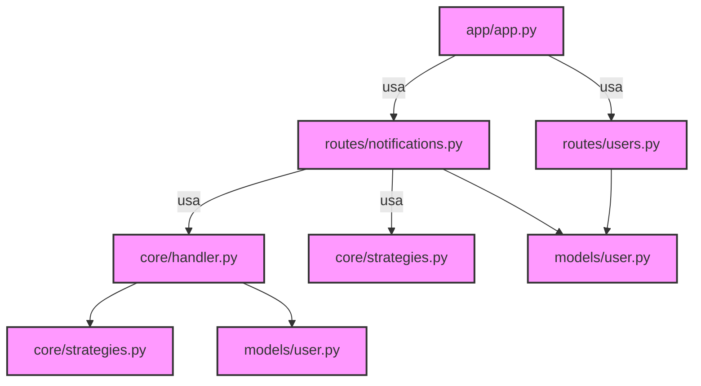
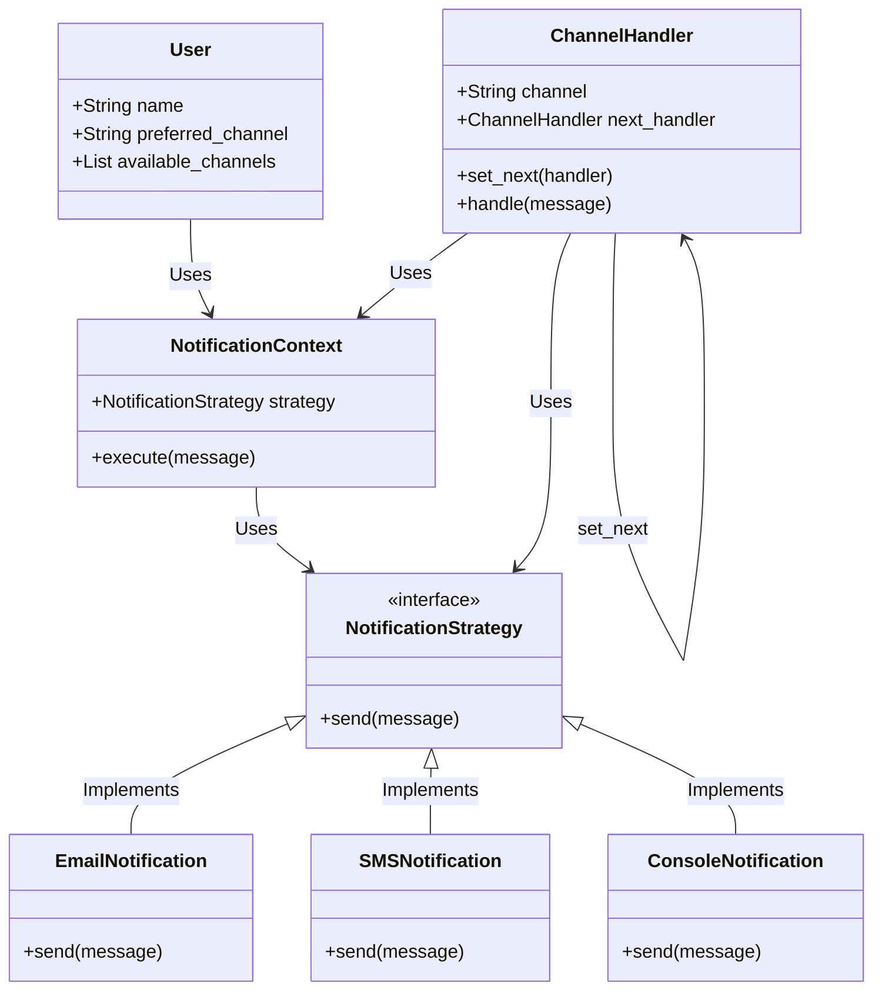

# Multichannel Notification System REST API

**Author:** Laura Valentina Pabón Cabezas

---

## System Overview

This project implements a REST API in Flask for a multichannel notification system. Users can register with multiple communication channels (email, SMS, console), and notifications are sent trying first the preferred channel and then alternative channels using the Chain of Responsibility pattern.

Message sending is simulated using the Strategy pattern, which encapsulates the concrete logic for each channel.

---

## API Endpoints

### Base URL
```
http://127.0.0.1:5000

```

### 1. Register a User
- **POST** `/users`
- **Headers:**
  Authorization: <token>
- **Body (JSON):**
```json
{
  "name": "Valentina",
  "preferred_channel": "email",
  "available_channels": ["email", "sms", "console"]
}
```
- **Response:**
  - `201 Created` `{description: User created }`

### 2. List Users
- **GET** `/users`
- **Headers:**
- **Response:**
  - `200: description: List of users`

### 3. Send Notification
- **POST** `/notifications/send`
- **Headers:**
  Authorization: <token>
- **Body (JSON):**
```json
{
  "user_name": "Juan",
  "message": "Tu cita es mañana.",
  "priority": "high"
}
```
- **Response:**
  - `200: description: Notification status`
  - `404: description: User not found`
---

## Class/Module Diagram

### dependency diagram


#### Explanation

1. app.py:
  -It is the main module that depends on users.py (to handle user routes), notifications.py (to handle notification routes), and Swagger (for documentation).
2. routes/users.py:
  -Depends on models/user.py, which defines the User class that manages user information.
3. notifications.py:
  -Depends on handler.py and strategies.py to manage the logic for sending notifications through different channels.
4. handler.py:
  -handler.py depends on strategies.py, since it uses the defined strategies to handle notifications via different channels (email, SMS, etc.).
5. strategies.py:
  -Defines the concrete strategies for sending notifications through the channels and is used both in handler.py and notifications.py.

### Class Diagram


#### Explanation
1. User: The class that represents users, with attributes such as the name and available channels.
2. NotificationStrategy: An interface that defines the method send(message), which must be implemented by the concrete notification classes (email, SMS, console).
3. EmailNotification, SMSNotification, ConsoleNotification: Classes that implement the NotificationStrategy interface, each with its own logic for sending notifications.
4. NotificationContext: This class holds a reference to the current strategy (for example, EmailNotification) and has a method execute(message) that delegates the sending of the message to the strategy.
5. ChannelHandler: The class that implements the Chain of Responsibility pattern. It manages a specific channel and, if it cannot send the message, passes the responsibility to the next ChannelHandler in the chain.
---

## Design Pattern Justifications

- **Chain of Responsibility:** Para intentar enviar notificaciones en cadena a través de múltiples canales hasta que uno funcione.  
- **Strategy:** Para encapsular la lógica de envío concreta de cada canal (email, sms, consola).  

---

## Installation and Running

### Requirements

- Python 3.x instalado

### Installation

```bash
git clone <repo_url>
cd notification_system
python -m venv env
source env/bin/activate      # En Windows: .\env\Scripts\activate
pip install -r requirements.txt
```

### Run the application
```bash
python -m app.app

```

### Swagger Documentation
Access the Swagger UI documentation at: http://127.0.0.1:5000/apidocs
---

## Curl Usage Examples

**Register a user:**
```bash
curl -X POST http://127.0.0.1:5000/users \
-H "Authorization: token" \
-H "Content-Type: application/json" \
-d '{"name":"Valentina","preferred_channel":"email","available_channels":["email","sms","console"]}'
```

**List users:**
```bash
curl -X GET http://127.0.0.1:5000/users \
-H "Authorization: token"
```

**Send a notification:**
```bash
curl -X POST http://127.0.0.1:5000/notifications/send \
-H "Authorization: token" \
-H "Content-Type: application/json" \
-d '{"user_name":"Juan","message":"Your appointment is tomorrow.","priority":"high"}'
```

### Using Insomnia
1. Open Insomnia and create a new request.
2. Set method (GET/POST) and URL (e.g., http://127.0.0.1:5000/users).
3. Add header Authorization: token.
4. For POST, add JSON body in the Body tab.
5. Click Send and see the response.

#### Register user


#### List users


#### Send notification


---
