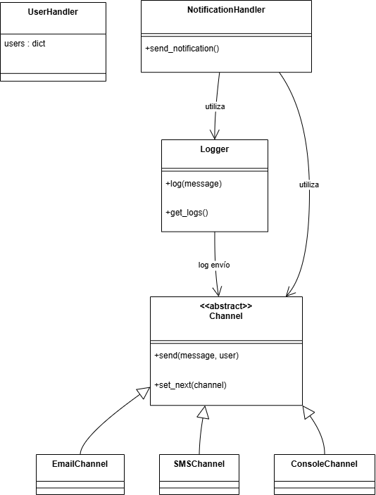
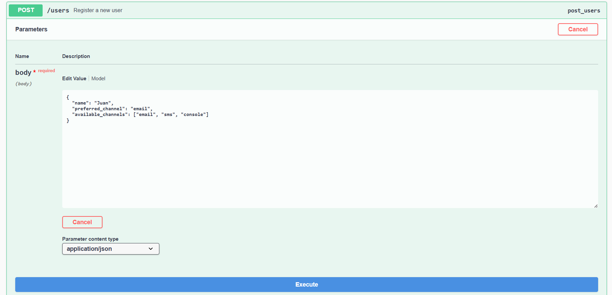
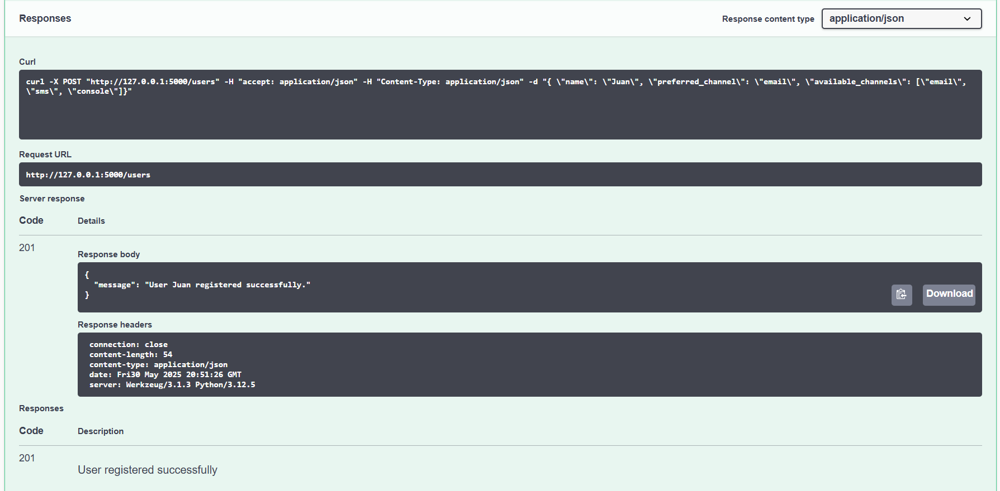
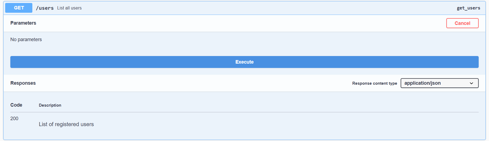
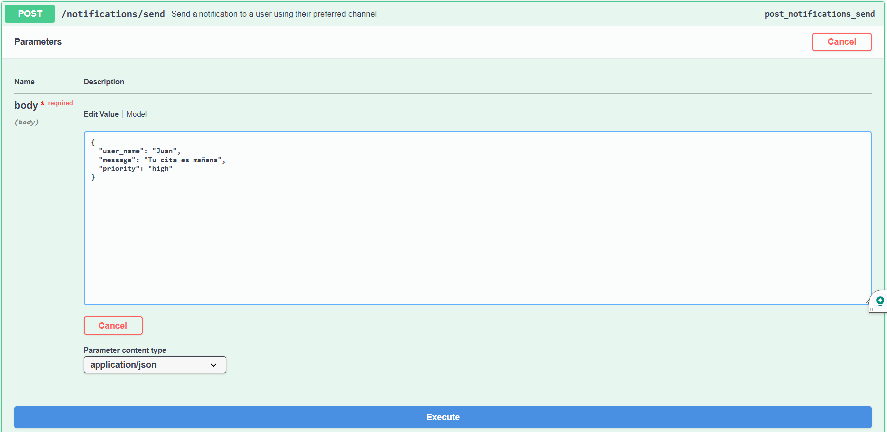
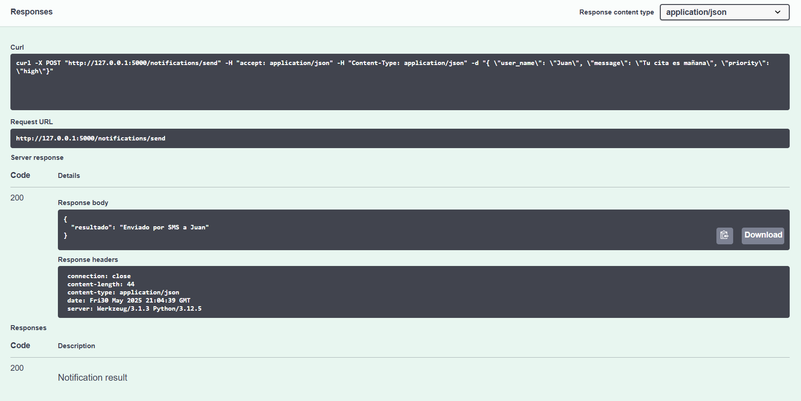

# 📬 Laboratorio 1 - Sistema de Notificaciones Multicanal

**Nombre completo:** Gabriel Castiblanco  
**Cédula:** 1001219707

---

## Descripción del sistema

Este sistema permite registrar usuarios con múltiples canales de comunicación disponibles (email, sms, consola) y enviarles notificaciones a través de su canal preferido. Si un canal falla (simulado aleatoriamente), se usa el siguiente disponible, aplicando el patrón de diseño **Chain of Responsibility**. Todos los intentos de envío son registrados por un logger único implementado como **Singleton**.

---

## Endpoints disponibles

| Método | Endpoint              | Descripción                                        |
|--------|------------------------|----------------------------------------------------|
| POST   | `/users`              | Registra un nuevo usuario con sus canales         |
| GET    | `/users`              | Lista todos los usuarios registrados              |
| POST   | `/notifications/send` | Envía una notificación con fallback automático     |

### `POST /users`

**Descripción:**  
Registra un nuevo usuario con su canal preferido y una lista de canales disponibles.

**Cuerpo esperado (JSON):**
```json
{
  "name": "Juan",
  "preferred_channel": "email",
  "available_channels": ["email", "sms", "console"]
}
```
Respuesta exitosa (201):

```json
Copiar
{
  "message": "User Juan registered successfully."
}
```
Errores posibles:

400: Faltan campos obligatorios

500: Error inesperado

### `GET /users`
**Descripción:**
Devuelve una lista de todos los usuarios registrados en memoria.

Respuesta exitosa (200):

```json
Copiar
{
  "Juan": {
    "preferred": "email",
    "available": ["email", "sms", "console"]
  }
}
```

### POST /notifications/send
**Descripción:**
Envía una notificación a un usuario. Si el canal preferido falla, se intenta con los siguientes canales disponibles en orden (Chain of Responsibility).

**Cuerpo esperado (JSON):**

```json
Copiar
{
  "user_name": "Juan",
  "message": "Tu cita es mañana",
  "priority": "high"
}
```
Respuesta exitosa (200):

```json
Copiar
{
  "resultado": "Enviado por SMS a Juan"
}
```
Errores posibles:

404: Usuario no encontrado

400: Usuario sin canales disponibles

---

## Patrones de diseño usados

### Chain of Responsibility
Permite encadenar múltiples canales de envío. Si uno falla, el siguiente se activa automáticamente.

### Singleton
Usado para el `Logger`, asegurando una única instancia en toda la aplicación.

---

## Diagrama de clases



## Setup y pruebas (con Swagger UI)

### Instalación del entorno

1. Crear un entorno virtual (opcional pero recomendado):

```bash
python -m venv venv
.\venv\Scripts\activate  # En Windows
```

2. Instalar las dependencias

```bash
pip install -r requirements.txt
```

3. Ejecutar el servidor Flask

```bash
python -m app.main
```

Abrir el navegador en: 

```arduino
http://127.0.0.1:5000/apidocs
```

### Pruebas
Una vez en http://127.0.0.1:5000/apidocs se pueden probar los enpoints

#### Crear usuario
POST /users


Respuesta


#### Listar usuarios
GET /users


#### Enviar notificación
POST /notifications/send


Respuesta


Además, en consola aparece:
[2025-05-30 16:04:39] Enviando notificación a Juan: Tu cita es mañana
[2025-05-30 16:04:39] Intentando enviar por EMAIL a Juan
[2025-05-30 16:04:39] Fallo EMAIL, intentando siguiente canal...
[2025-05-30 16:04:39] Intentando enviar por SMS a Juan
[2025-05-30 16:04:39] SMS enviado exitosamente a Juan: Tu cita es mañana
127.0.0.1 - - [30/May/2025 16:04:39] "POST /notifications/send HTTP/1.1" 200 -

## Documentación Swagger
Este proyecto utiliza Swagger UI (mediante la librería flasgger) para documentar automáticamente todos los endpoints de la API REST.

Una vez el servidor esté corriendo, se puede acceder a la documentación completa desde:

http://127.0.0.1:5000/apidocs

Allí se puede:

Ver todos los endpoints disponibles.

Leer la descripción, parámetros, tipos de datos y respuestas esperadas.

Probar la API directamente desde el navegador usando formularios interactivos.

¿Cómo se genera?
Cada endpoint tiene un bloque de documentación como este:

"""
Register a new user
parameters:

name: body
in: body
required: true
schema:
id: User
properties:
name:
type: string
preferred_channel:
type: string
available_channels:
type: array
items:
type: string
responses:
201:
description: User registered
"""

Estos bloques permiten que Swagger genere automáticamente la interfaz visual sin necesidad de escribir archivos OpenAPI manualmente.