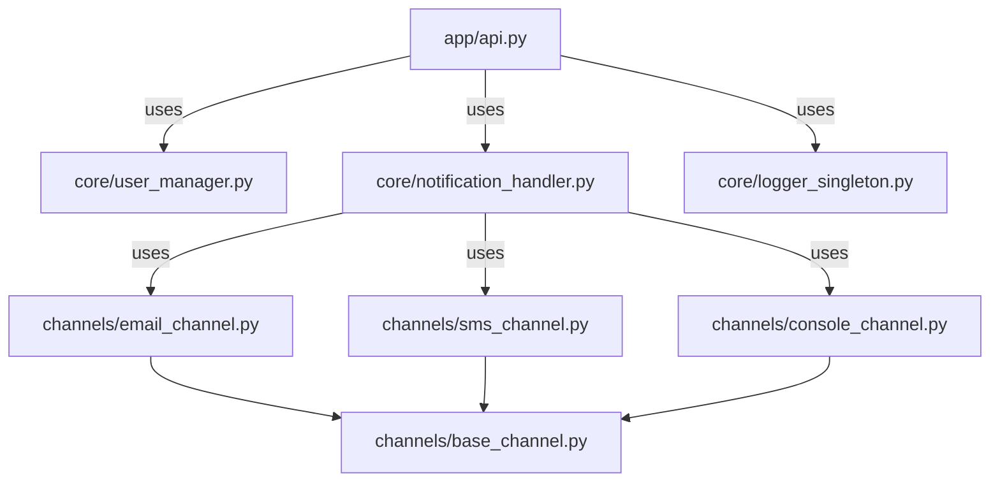
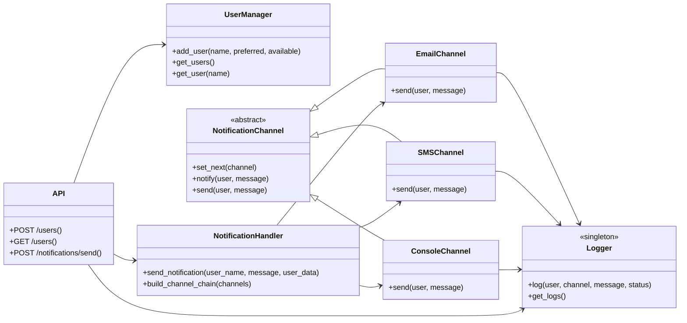

# Notification API

**Author:** Jorge Andres Torres Leal

---

## System Overview

This project is a RESTful API for managing users and sending notifications through different channels (email, SMS, console). It is built using Python, Flask, and Flask-RESTX, following best practices in modularity and design patterns.

- **Users** can be registered with their preferred and available notification channels.
- **Notifications** can be sent to users, attempting delivery through their preferred channel and falling back to others if needed.

---

## API Endpoints

### Base URL
```
http://localhost:5000/api
```

### 1. Register a User
- **POST** `/users`
- **Request Body:**
```json
{
  "name": "Juan",
  "preferred_channel": "email",
  "available_channels": ["email", "sms", "console"]
}
```
- **Response:**
  - `201 Created` `{ "message": "User registered" }`

### 2. List Users
- **GET** `/users`
- **Response:**
  - `200 OK` `{ "user1": {...}, "user2": {...} }`

### 3. Send Notification
- **POST** `/notifications/send`
- **Request Body:**
```json
{
  "user_name": "Juan",
  "message": "¡Hola! Esta es una prueba",
  "priority": "high"
}
```
- **Response:**
  - `200 OK` `{ "status": "delivered" }`
  - `404 Not Found` `{ "error": "User not found" }`
  - `500 Internal Server Error` `{ "status": "failed" }`

---

## Class/Module Diagram







---

## Design Pattern Justifications

- **Singleton:**
  - `Logger` uses the Singleton pattern to ensure a single, thread-safe logging instance across the application.
- **Chain of Responsibility:**
  - Notification channels (email, SMS, console) are linked in a chain. If the preferred channel fails, the next available channel is tried automatically.
- **Factory Method:**
  - The function that builds the channel chain instantiates channel objects based on user configuration.
- **Repository:**
  - `UserManager` acts as a repository for user data, centralizing CRUD operations.
- **Strategy:**
  - Each notification channel implements a common interface, allowing the notification sending strategy to be swapped at runtime.
- **Facade:**
  - The API acts as a facade, exposing a simple interface for complex notification logic.

---

## Setup Instructions

1. **Clone the repository**
2. **Create and activate a virtual environment:**
   ```bash
   python -m venv venv
   # On Windows:
   venv\Scripts\activate
   # On Linux/Mac:
   source venv/bin/activate
   ```
3. **Install dependencies:**
   ```bash
   pip install -r laboratories/laboratory_1/1006795789/requirements.txt
   ```
4. **Run the application:**
   ```bash
   cd laboratories/laboratory_1/1006795789
   python run.py
   ```
5. **Access the API documentation:**
   - Open [http://localhost:5000/docs](http://localhost:5000/docs) in your browser for interactive Swagger UI.

---

## Testing Instructions

### Using curl

**Register a user:**
```bash
curl -X POST http://localhost:5000/api/users \
  -H "Content-Type: application/json" \
  -d '{"name": "Juan", "preferred_channel": "email", "available_channels": ["email", "sms", "console"]}'
```

**List users:**
```bash
curl http://localhost:5000/api/users
```

**Send a notification:**
```bash
curl -X POST http://localhost:5000/api/notifications/send \
  -H "Content-Type: application/json" \
  -d '{"user_name": "Juan", "message": "¡Hola! Esta es una prueba", "priority": "high"}'
```

### Using Postman
1. Import the endpoints as described above.
2. Set the request type (GET/POST), URL, and body as shown in the curl examples.
3. Send the request and view the response.

#### POST_USER


#### POST_NOTIFICATIONS


#### POST_NOTIFICATIONS


---

## Notes
- Make sure the virtual environment is activated before running or testing the API.
- All endpoints are prefixed with `/api` due to the namespace configuration.
- The interactive documentation is available at `/docs`. 