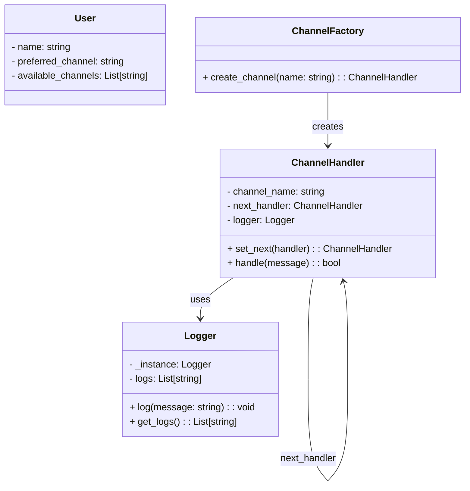

# 📨 Multichannel Notification System – Individual Lab

**Full Name:** Diego Felipe Solorzano Aponte

---

## 📌 Description

This project implements a **modular REST API** in **Flask** to manage users and send notifications through multiple communication channels (email, SMS, console). Each user defines a preferred channel, but if it fails, the system tries other available channels using a chain of responsibility. Delivery is simulated with random failures.

---

## 🎯 System Objectives

- Allow user registration and retrieval.
- Send notifications using the preferred channel, falling back to others if it fails.
- Simulate delivery failures using `random.choice([True, False])`.
- Log all delivery attempts.
- Apply two design patterns:
  - Chain of Responsibility
  - Singleton

---

## 🧠 Design Patterns Used

### 🔗 Chain of Responsibility

Each notification channel is linked to a `next_handler`. If a channel fails, the next one tries to deliver the notification. This ensures progressive and fault-tolerant delivery.

```plaintext
email → sms → console
```

This makes the system easily extensible: to add a new channel, just chain another handler.

### 🧭 Singleton

To log notification attempts, a Logger class implements the Singleton pattern. This guarantees there is only one shared instance of the logger throughout the system, accessible from anywhere.

```python
logger = Logger()
logger.log("Trying to send via email...")
```

> 📝 **Note:**  The file utils/logger.py contains this implementation. It is placed in the utils folder because it acts as a transversal utility independent of business domain logic.
---

## 🧪 Endpoints

### `POST /users`

Register a new user

```json
{
  "name": "Juan",
  "preferred_channel": "email",
  "available_channels": ["email", "sms", "console"]
}
```

### `GET /users`

List all registered users
### `POST /notifications/send`

Send a notification to a user:
```json
{
  "user_name": "Juan",
  "message": "Tu cita es mañana.",
  "priority": "high"
}
```

## Classes diagram




## Explanation:

User: Represents a user with a name, a preferred notification channel, and a list of available channels they can receive notifications through.

ChannelHandler: Abstract handler for notification channels. It holds the channel’s name, a reference to the next handler in the chain (next_handler), and a logger instance. The methods set_next() and handle() manage the chain of responsibility pattern, trying to send messages and passing the task along if it fails.

ChannelFactory: Responsible for creating channel handler instances based on a channel name, enabling easy addition of new notification channels.

Logger: Implements the Singleton pattern to ensure only one logger instance exists. It stores logs of all notification attempts and provides methods to add new logs and retrieve existing ones.

### The arrows illustrate relationships:

ChannelFactory creates ChannelHandler objects.

Each ChannelHandler may pass work to the next_handler.

Each ChannelHandler uses the shared Logger to record attempts.


## 🔧How to Run the Project

### 1. Clone the repository and enter the project directory

```bash
git clone <https://github.com/SwEng2-2025i/LM18h.git>
cd <1016942037>
```

### 2. Activate your virtual environment

```bash
# Windows PowerShell
.\env\Scripts\Activate.ps1
```

### 3. Install dependencies

```bash
pip install -r requirements.txt
```

### 4.  Run the server

```bash
python run.py
```

---

## 🧰 Testing

### ✅ Vía Swagger

Open your browser at:

```
http://127.0.0.1:5000/apidocs
```

You can test all endpoints interactively using the Swagger UI thanks to Flasgger integration.
---

## ✅ Usage Examples with Insomnia
1. Open Insomnia and create a new request.
2. Set method (GET/POST) and URL (e.g., http://127.0.0.1:5000/users).
3. Add header Authorization: token.
4. For POST, add JSON body in the Body tab.
5. Click Send and see the response.

---
