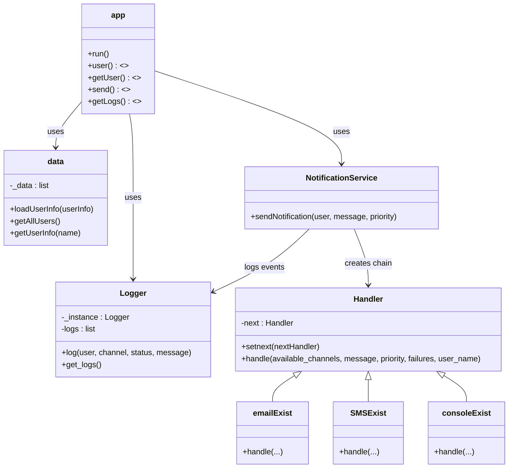

# 📨 Notification System - Valentina Chicuasuque Rodriguez

This service implements a  REST API for user management and notification sending through channels such as email, SMS, and console, using Flask and software design patterns.

---


## 🔌 API Endpoints


### POST /users
Registers a new user.

**Request:**
```json
{
  "name": "Laura",
  "preferred_channel": "email",
  "available_channels": ["email", "SMS"]
}
``` 


### GET /users
Returns all registered users in a list.

**Request:**
```json
[
	{
		"available_channels": [
			"email",
			"SMS"
		],
		"name": "Laura",
		"preferred_channel": "email"
	}
]
``` 
### POST /notification/send
Sends a notification to the specified user.

**Request:**
```json
{
  "user_name": "Laura",
  "message": "Your appointment is tomorrow.",
  "priority": "high"
}
``` 

### GET /logs
Returns all notification attempts (success or failure).

**Request:**
```json
[
	{
		"channel": "email",
		"message": "Your appointment is tomorrow.",
		"status": "success",
		"timestamp": "2025-05-27T11:53:49.332284",
		"user": "Laura"
	}
]
```

## 🔧 Class/module diagram



## Design Pattern justifications
The notification system implements the following design patterns:

#### Chain of Responsability
Used in managing notification channels to pass the message through a chain of handlers that verify if the channel is available to send a notification.

#### Singleton
This pattern is used to ensure there is a single instance of the logger during the system execution, responsible for storing and managing all logs, thus providing easy access to notification information.

## Setup and testing instructions

1. Clone the repository
	```
	cd NotificationSystem
	```

2. Install dependecies:
	```
	pip install -r requiriments.txt
	```
	#### Running application
 	Start the Flask server on port 4000:
	```
	python app.py
	```

- The app will be available at:
	```
	http://localhost:4000
	```

	#### Testing Endpoints with curl
- Register a new user:
	```
		curl -X POST http://localhost:4000/users \
		-H "Content-Type: application/json" \
		-d '{"name":"Pablo","preferred_channel":"email","available_channels":["email","SMS"]}

	```
- Get all users
	```
	curl http://localhost:4000/users
	```

- Send notification
	```
	curl -X POST http://localhost:4000/notification/send \
	-H "Content-Type: application/json" \
	-d '{"user_name":"Pablo","message":"Hello!","priority":1}'
	```

- Get logs
	```
	curl http://localhost:4000/logs
	```


