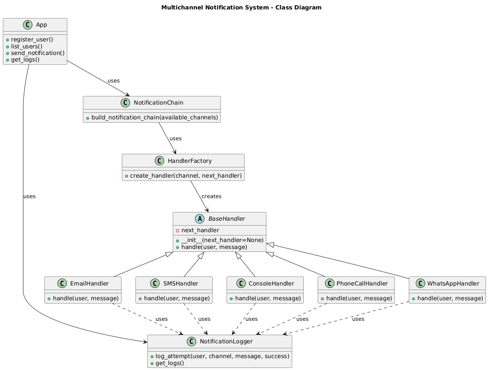

# Multichannel Notification System

👤 **Nombre Completo:** Carlos Julian Reyes Piraligua
👤 **Número de Identificación:** 1021393606

---

## 📝 Descripción general del sistema

Este proyecto implementa un sistema de notificaciones multicanal mediante una API REST construida en Flask. Los usuarios pueden registrarse con múltiples canales de comunicación:

- Email
- SMS
- Console
- Phone Call
- WhatsApp

Cuando se envía una notificación, el sistema utiliza un patrón de **Chain of Responsibility** para intentar entregar el mensaje por los canales disponibles. El envío es simulado y puede fallar aleatoriamente.

Adicionalmente, se ha implementado el patrón **Factory Method** para crear dinámicamente los handlers de cada canal, y el patrón **Singleton** para centralizar los logs de notificación. Finalmente, la documentación de la API está integrada mediante **Swagger**.

---

## 🎯 Endpoints de la API

| Método | Endpoint              | Descripción                      |
| ------ | --------------------- | -------------------------------- |
| `POST` | `/users`              | Registrar usuario                |
| `GET`  | `/users`              | Listar usuarios                  |
| `POST` | `/notifications/send` | Enviar notificación              |
| `GET`  | `/notifications/logs` | Consultar logs de notificaciones |

---

## 📦 Payloads de ejemplo

### Registrar usuario

**POST /users**

```json
{
  "name": "Maria",
  "preferred_channel": "whatsapp",
  "available_channels": ["email", "whatsapp", "sms"]
}
```

### Enviar notificación

**POST /notifications/send**

```json
{
  "user_name": "Maria",
  "message": "Your appointment is tomorrow.",
  "priority": "high"
}
```

> ⚠ En esta versión la prioridad es recibida pero no modifica el orden de envío.

### Consultar usuarios

**GET /users**

_No requiere body, simplemente realiza la petición._

### Consultar logs

**GET /notifications/logs**

_No requiere body, simplemente realiza la petición._

---

## 🧠 Diseño del sistema

### 🧩 Patrones de Diseño Utilizados

| Patrón                      | Descripción                                                             | Ubicación                            |
| --------------------------- | ----------------------------------------------------------------------- | ------------------------------------ |
| **Chain of Responsibility** | Permite probar los canales disponibles uno a uno, de forma desacoplada. | `handlers/`, `notification_chain.py` |
| **Factory Method**          | Facilita la creación modular de handlers según el tipo de canal.        | `factories/handler_factory.py`       |
| **Singleton**               | Asegura que todos los logs de notificación quedan centralizados.        | `logger.py`                          |

---

### 📂 Estructura de Carpetas

```bash
project/
│
├── app.py                  # Servidor Flask con Swagger integrado
├── logger.py               # Logger Singleton
├── notification_chain.py   # Construcción de la cadena de envío
│
├── handlers/               # Chain of Responsibility
│   ├── base_handler.py
│   ├── email_handler.py
│   ├── sms_handler.py
│   ├── console_handler.py
│   ├── phone_call_handler.py
│   └── whatsapp_handler.py
│
├── factories/              # Factory Method
│   └── handler_factory.py
│
├── README.md               # Documentación
├── requirements.txt        # Dependencias
└── diagrama.png            # Diagrama de clases (UML)
```

---

## 🔧 Setup e instalación

### 1️⃣ Clonar el repositorio

```bash
git clone [URL_DEL_REPOSITORIO]
```

### 2️⃣ Crear un entorno virtual

> Este proyecto requiere el uso de un entorno virtual para aislar las dependencias.

#### Windows (CMD o PowerShell):

```bash
python -m venv venv
venv\Scripts\activate
```

#### Mac / Linux:

```bash
python3 -m venv venv
source venv/bin/activate
```

> **Nota:** Siempre asegúrate de activar el entorno virtual antes de correr el proyecto.

---

### 3️⃣ Instalar dependencias

```bash
pip install -r requirements.txt
```

> El archivo `requirements.txt` contiene:

```txt
flask
flasgger
```

---

### 4️⃣ Ejecutar la aplicación

Con el entorno virtual activado, ejecuta:

```bash
python app.py
```

La aplicación quedará corriendo en:

```
http://127.0.0.1:5000
```

---

### 5️⃣ Acceder a la documentación Swagger

Una vez que el servidor esté activo, puedes acceder a la documentación interactiva de la API en:

```
http://127.0.0.1:5000/apidocs/
```

Aquí podrás visualizar todos los endpoints disponibles, sus parámetros, respuestas y probar las solicitudes directamente desde el navegador.

---

## 🚀 Pruebas rápidas con curl (adaptadas para Windows)

### Registro de usuario

```bash
curl -X POST http://127.0.0.1:5000/users -H "Content-Type: application/json" -d "{\"name\": \"Maria\", \"preferred_channel\": \"whatsapp\", \"available_channels\": [\"email\", \"whatsapp\", \"sms\"]}"
```

### Enviar notificación

```bash
curl -X POST http://127.0.0.1:5000/notifications/send -H "Content-Type: application/json" -d "{\"user_name\": \"Maria\", \"message\": \"Your appointment is tomorrow.\", \"priority\": \"high\"}"
```

### Consultar logs

```bash
curl http://127.0.0.1:5000/notifications/logs
```

---

## 🎯 Diagrama del sistema



---

## 📄 Justificación de patrones de diseño

- **Chain of Responsibility:** permite probar los canales disponibles uno a uno, de forma desacoplada.
- **Factory Method:** facilita la creación modular de handlers según el tipo de canal.
- **Singleton:** asegura que todos los logs de notificación quedan centralizados.
- **Swagger (Flasgger):** permite generar documentación automática interactiva de los endpoints.

---
