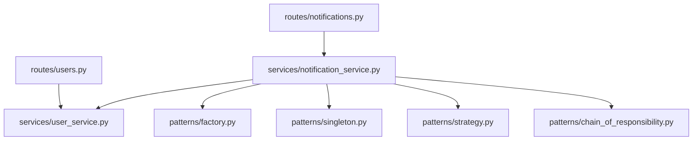
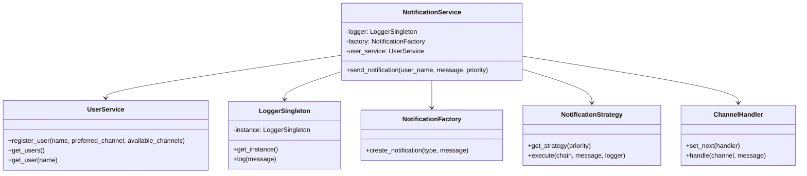
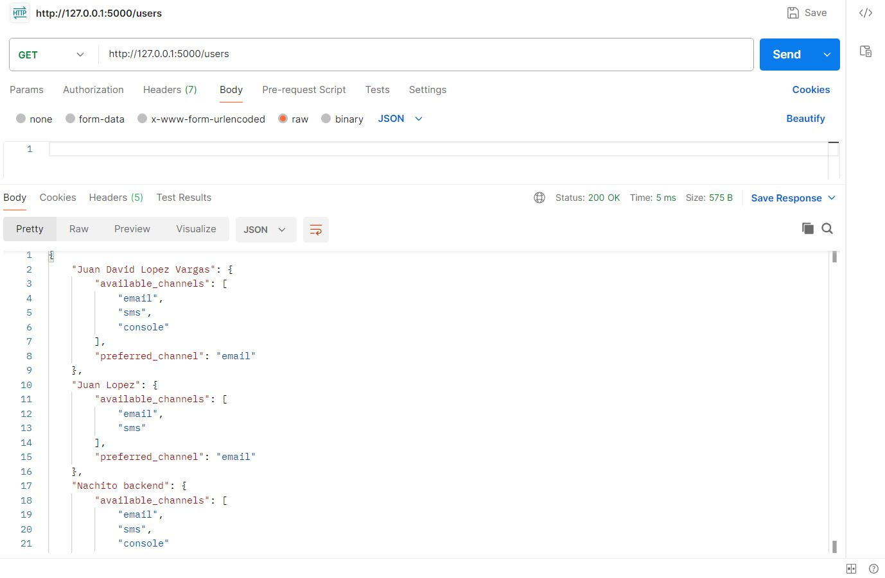
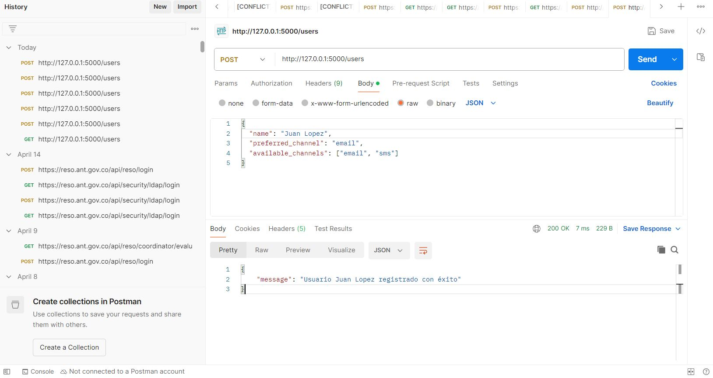
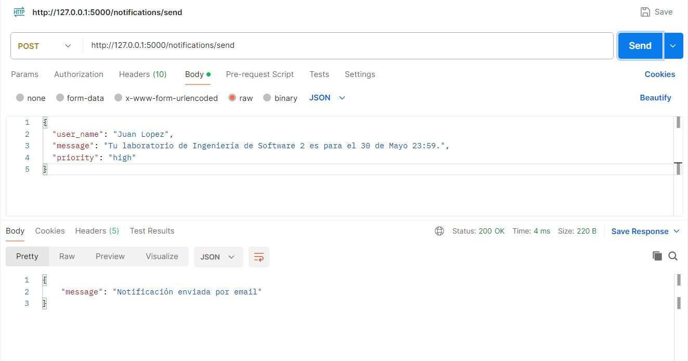
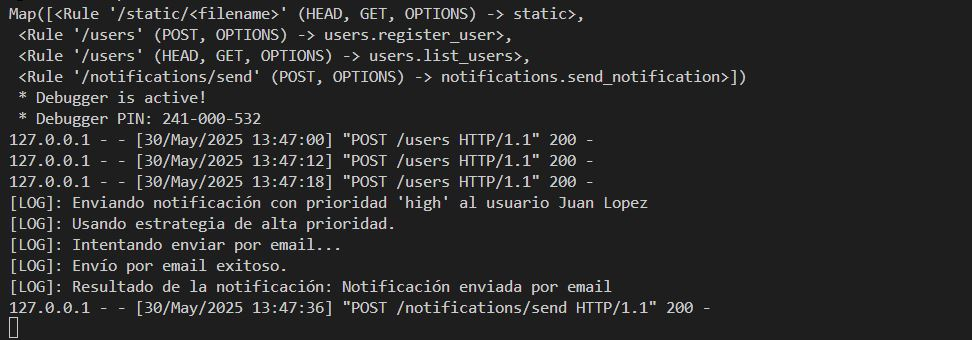
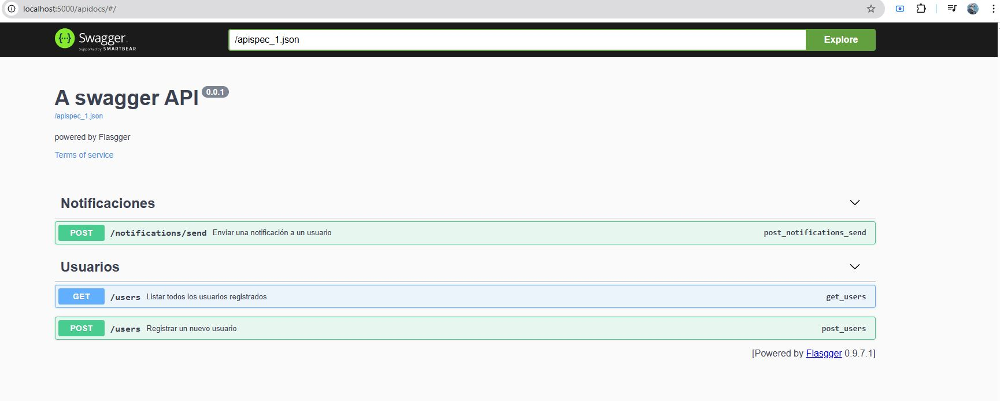

# Project Title

A brief description of what this project does and who it's for

# Sistema de Notificaciones - API REST

Este proyecto es una API REST desarrollada en Python con Flask. Implementa un sistema de notificaciones para usuarios utilizando diversos patrones de diseño de software.

---

## 1. Instalación y despliegue del servidor de la API REST

### Requisitos:

* Python >= 3.10
* pip (instalador de paquetes)

### Pasos:

```bash
# 1. Clonar el repositorio
https://github.com/SwEng2-2025i/LM18h/tree/main/laboratories/laboratory_1/1022412746
cd api-notificaciones

# 2. Instalar dependencias
pip install -r requirements.txt

# 3. Ejecutar servidor Flask
export FLASK_APP=app/app.py        
# En Windows: set FLASK_APP=app/app.py
flask run

o simplemente
python main.py 
```

La API estará disponible en: `http://127.0.0.1:5000/`

---

## 2. Endpoints implementados

### `POST /users`

Registra un nuevo usuario.

### `GET /users`

Devuelve todos los usuarios registrados.

### `POST /notifications/send`

Envía una notificación a un usuario según su canal preferido y estrategia definida por prioridad.

---

## 3. Patrones de diseño implementados

| Patrón                  | Descripción                                                                    |
| ----------------------- | ------------------------------------------------------------------------------ |
| Singleton               | Para el `LoggerSingleton`, asegura una sola instancia de logger.               |
| Factory                 | Para crear objetos de notificaciones según el tipo de canal.                   |
| Strategy                | Para seleccionar la estrategia de envío según la prioridad.                    |
| Chain of Responsibility | Permite encadenar los `ChannelHandler` en orden según preferencia del usuario. |

---

## 4. Pruebas CURL

### a) Crear usuario

```bash
curl -X POST http://127.0.0.1:5000/users \
     -H "Content-Type: application/json" \
     -d '{
  "name": "Juan David Lopez Vargas",
  "preferred_channel": "email",
  "available_channels": ["email", "sms", "console"]
}'
```

**Respuesta esperada:**

```json
{"message": "Usuario registrado con éxito"}
```

### b) Enviar notificación

```bash
curl -X POST http://127.0.0.1:5000/notifications/send \
     -H "Content-Type: application/json" \
     -d '{
  "user_name": "Juan David Lopez Vargas",
  "message": "Tu laboratorio de Ingeniería de Software 2 es para el 30 de Mayo 23:59.",
  "priority": "high"
}'
```

**Respuesta esperada:**

```json
{"message": "Notificación enviada por email: Tu laboratorio de Ingeniería de Software 2 es para el 30 de Mayo 23:59."}
```

---

## 5. Diagramas de arquitectura y clases

### a) Diagrama de dependencias (Mermaid UML)



### b) Diagrama de clases (Mermaid UML)



---

## 6. Justificación de patrones de diseño

### Singleton

Se utiliza para el `LoggerSingleton` con el fin de asegurar que todos los componentes de la aplicación escriban en una única instancia de logger, evitando conflictos de concurrencia o múltiples puntos de acceso.

### Factory

Se implementa el patrón Factory para encapsular la creación de notificaciones dependiendo del tipo de canal (`email`, `sms`, `console`). Esto permite extender fácilmente los tipos de notificaciones sin modificar la lógica del servicio.

### Strategy

Permite elegir dinámicamente una estrategia de envío según la prioridad del mensaje. Esto desacopla la lógica del tipo de prioridad del resto de la lógica de negocio, facilitando la extensión a estrategias como reintentos, espera, etc.

### Chain of Responsibility

Facilita la composición dinámica de canales de envío en función de las preferencias del usuario. Si un canal falla, la cadena continúa con el siguiente canal disponible. Este patrón mejora la tolerancia a fallos y la flexibilidad del flujo de procesamiento.

---

## 7. Probando con Postman

Puedes realizar pruebas de los endpoints utilizando [Postman](https://www.postman.com/):

1. Abre Postman y crea una nueva solicitud.
2. Establece el método (GET o POST) y la URL (por ejemplo, `http://127.0.0.1:5000/users`).
3. Para métodos POST, selecciona la pestaña **Body**, elige **raw** y el formato **JSON**, luego ingresa el cuerpo de la solicitud.
4. Haz clic en **Send** para ver la respuesta.

### a) GET /users



### b) POST /users



### c) POST /notifications/send



### d) Logs envío mensaje



###  Documentación y test vía SWAGGER

También podemos realizar pruebas y la documentación de los endpoints utilizando la herramiento swagger


Consulta la documentación en (`http://localhost:5000/apidocs/`).


---

### Autor

Juan Lopez - Proyecto de laboratorio - Ingeniería de Software 2
