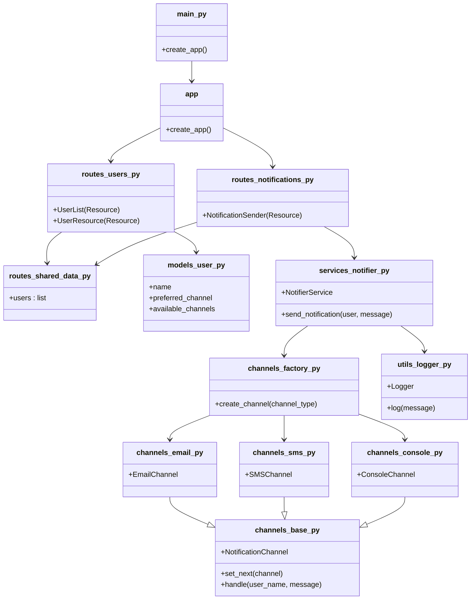

# 📨 Notification REST API

## Autor: Samuel Reyes Benavides

### 🧩 Descripción del Sistema de Software

Este proyecto implementa una API RESTful en Flask para gestionar usuarios y enviar notificaciones con canales de respaldo en caso de fallo. Cada usuario tiene un canal preferido y una lista de canales alternativos. Si el canal principal falla, el sistema recurre a los siguientes hasta lograr el envío o agotar las opciones.

- La información se guarda en memoria (sin base de datos).
- El sistema usa Flask y Flask-RESTX para facilitar la documentación automática con Swagger.
- El diseño es modular, limpio y fácil de mantener.

### 📌 Endpoints Disponibles

#### 👥 `/users`  
- **GET** → Devuelve la lista completa de usuarios registrados.  
- **POST** → Registra un nuevo usuario.

**Ejemplo POST:**
```json
{
  "name": "Alice",
  "preferred_channel": "email",
  "available_channels": ["email", "sms", "console"]
}
```

#### 👤 `/users/<name>`  
- **PUT** → Actualiza los canales de un usuario.  
- **DELETE** → Elimina un usuario por su nombre.

**Ejemplo PUT:**
```json
{
  "name": "Alice",
  "preferred_channel": "sms",
  "available_channels": ["sms", "console"]
}
```

#### ✉️ `/notifications/send`  
- **POST** → Envía una notificación a un usuario usando su canal preferido, con fallback si falla.

**Ejemplo POST:**
```json
{
  "user_name": "Alice",
  "message": "Hola, Alice!",
  "priority": "high"
}
```
### 🏗️ Diagrama de Clases/Modulos


## 🎯 Patrones de Diseño

### 1. 🔗 Chain of Responsibility  
Este patrón se utiliza para la lógica de envío de notificaciones. Cada canal (como `email`, `sms` o `console`) intenta enviar la notificación. Si falla, pasa la solicitud al siguiente canal disponible en la lista del usuario.

**Ventajas:**
- Facilita la extensión: agregar un nuevo canal requiere solo una nueva clase.
- El código para manejar el envío está desacoplado del flujo principal.

### 2. 🔒 Singleton (Logger)  
El logger personalizado implementa el patrón Singleton para asegurar que solo exista una instancia de logger a lo largo de toda la aplicación.

**Ventajas:**
- Centraliza el registro de eventos e intentos de notificación.
- Asegura consistencia en el formato y almacenamiento de logs.

### 3. 🏭 Factory

Este patrón se aplica para la creación dinámica de los canales de notificación. En lugar de instanciar directamente objetos de `EmailChannel`, `SMSChannel`, o `PushChannel`, se utiliza una función `create_channel(tipo)` que encapsula la lógica de instanciación.

**Ventajas:**
- Desacopla la lógica de creación de objetos del flujo de negocio.
- Facilita la extensión: para agregar un nuevo canal, solo es necesario crear su clase y extender el factory.
- Mejora la legibilidad y evita condicionales repetitivos al construir la cadena de notificación.


---

## 🧪 Instrucciones de Setup y Testing

### ⚙️ Instalación y ejecución

1. Instala dependencias:
```bash
pip install -r requirements.txt
```

2. Ejecuta el servidor:
```bash
python main.py
```

3. Accede a Swagger UI en el navegador:
```
http://localhost:5000/docs
```

### 📮 Pruebas con cURL (Postman)

#### Crear usuario
```bash
curl -X POST http://localhost:5000/users   -H "Content-Type: application/json"   -d '{
        "name": "Alice",
        "preferred_channel": "email",
        "available_channels": ["email", "sms", "console"]
      }'
```

#### Listar usuarios
```bash
curl http://localhost:5000/users
```

#### Actualizar usuario
```bash
curl -X PUT http://localhost:5000/users/Alice   -H "Content-Type: application/json"   -d '{
        "name": "Alice",
        "preferred_channel": "sms",
        "available_channels": ["sms", "console"]
      }'
```

#### Eliminar usuario
```bash
curl -X DELETE http://localhost:5000/users/Alice
```

#### Enviar notificación
```bash
curl -X POST http://localhost:5000/notifications/send   -H "Content-Type: application/json"   -d '{
        "user_name": "Alice",
        "message": "Hola, Alice!",
        "priority": "high"
      }'
```
## 📖 Documentación Swagger

La API expone su documentación interactiva utilizando Swagger UI, accesible tras iniciar el servidor en [http://localhost:5000/docs](http://localhost:5000/docs).

A través de esta interfaz es posible:
- Probar todos los endpoints (`/users`, `/notifications/send`) directamente desde el navegador.
- Consultar los modelos de datos esperados para cada petición.
- Visualizar ejemplos de request y response.
