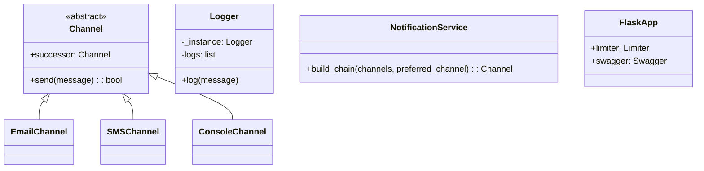
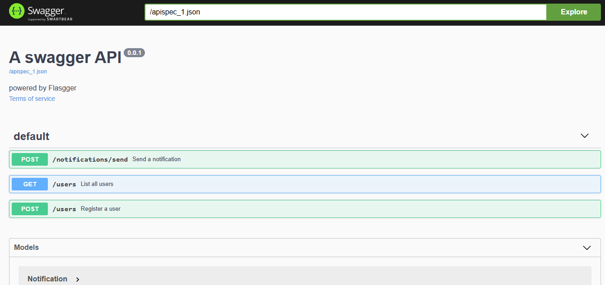

# Notification System API

**Author:** Karen Lorena Guzman del Rio
**Version:** 1.0.0  

---

## 🧠 Overview  

This is a Flask-based notification system API that implements the Chain of Responsibility design pattern to handle message delivery through multiple channels (Email, SMS, Console). The system allows:

1. User registration with preferred notification channels
2. Sending notifications through a fallback chain of channels
3. API documentation via Swagger UI
4. Authorization requirement for all endpoints

---

## ✨ Key Features

- Chain of Responsibility pattern for channel fallback
- Singleton Logger for centralized logging
- Rate limiting for API protection
- Swagger documentation
- Authorization decorator

---

## 📘 Endpoint Documentation

⚠️ All endpoints require an Authorization header (any value is accepted by the current implementation).

### **1. Register User**

**`POST /users`**  
Registers a user with preferred notification channels.  

**Request:**

```json
{
  "name": "string",
  "preferred_channel": "email|sms|console",
  "available_channels": ["email", "sms", "console"]
}
```

**Response:**

- 201 Created on success
- 400 Bad Request if preferred channel is invalid

### **2. List Users**  

**`GET /users`**
Returns all registered users.

**Response:**

```json
[
  {
    "name": "test",
    "preferred_channel": "email",
    "available_channels": ["email", "sms"]
  }
]
```

### **3. Send Notification**

**`POST /notifications/send`**  
Sends a message via the user's preferred channel (falls back if failed).

**Request:**  

```json
{
  "user_name": "string",
  "message": "Hello!",
  "priority": "low|medium|high"
}
```

**Response:**

```json
{"status": "delivered|failed"}
```

---

## 📌 System desing



---

## 🧩 Design Patterns

1. Chain of Responsibility – Channels
**Reason:** Enables automatic fallback if a channel fails.
**Implementation:** Abstract `Channel` class with concrete implementations: `EmailChannel`, `SMSChannel`, and `ConsoleChannel`.

2. Singleton – Logger
**Reason:** Centralizes system logging.
**Implementation:** `Logger` class using `__new__` to ensure a single instance.

3. Decorator – Authorization
**Reason:** Adds authorization without modifying the endpoint logic.
**Implementation:** `require_authorization` decorator that checks for the header.

---

## 🚀 Setup

### **Prerequisites**

- Python 3.8+
- Pip

### **Installation**

```bash
git clone [repo-url]
cd [directory-name]
pip install -r requirements.txt
```

### **Run**

```bash
python run.py
```

Access Swagger UI at: <http://localhost:5000/apidocs>

---

## 🧪 Testing

**cURL Examples**
1.**Register User:**

```bash
curl -X POST http://localhost:5000/users \
-H "Authorization: Bearer demo" \
-H "Content-Type: application/json" \
-d '{"name":"alice","preferred_channel":"sms","available_channels":["sms","console"]}'
```

2.**List users:**

```bash
curl -X GET http://localhost:5000/users \
-H "Authorization: Bearer demo"
```

3.**Send Notification:**

```bash
curl -X POST http://localhost:5000/notifications/send \
-H "Authorization: Bearer demo" \
-H "Content-Type: application/json" \
-d '{"user_name":"alice","message":"Test","priority":"high"}'
```

---

## 📚 Swagger Documentation

Interactive docs available at /apidocs:

