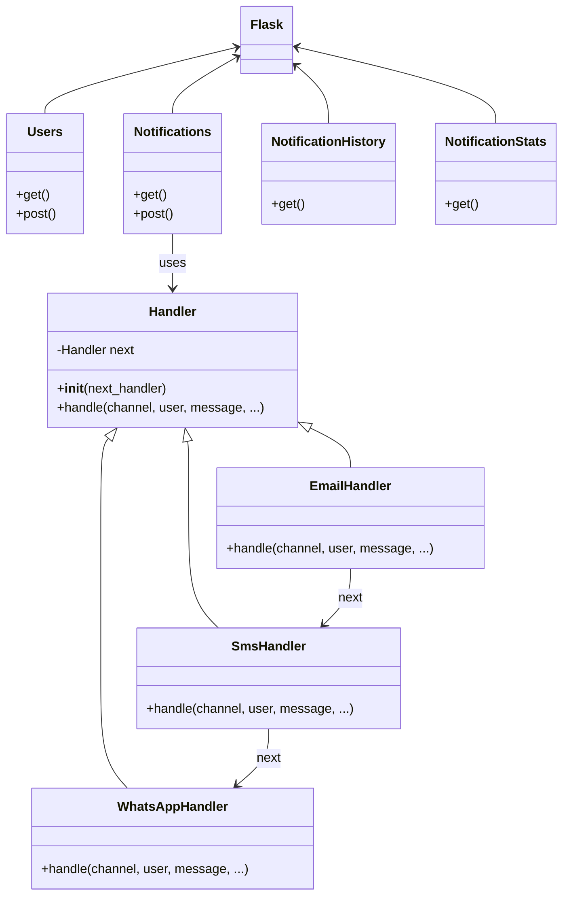

# Sistema de Notificaciones con Chain of Responsibility

**Autor:** Maria Paula Carvajal Martinez
**Email:** marcarvajalma@unal.edu.co  

## Descripción del Sistema

Este sistema implementa una API REST desarrollada con Flask que gestiona la entrega de notificaciones utilizando el patrón de diseño **Chain of Responsibility**. El sistema permite registrar usuarios con sus preferencias de comunicación y enviar notificaciones con mecanismos de respaldo automático, manteniendo un historial completo de todos los intentos de entrega.

## Arquitectura y Patrones de Diseño

El uso del patrón Chain of Responsibility en el manejo de notificaciones permite un alto nivel de desacoplamiento, ya que cada handler es independiente y puede modificarse sin afectar a los demás. Esta estructura aporta flexibilidad para agregar nuevos canales de comunicación y seguir el principio de responsabilidad única, ya que cada handler se encarga exclusivamente de un tipo de canal. Además, facilita la configuración del orden de prioridad de los canales y proporciona tolerancia a fallos, ya que si un canal no funciona, el sistema continúa automáticamente con el siguiente disponible.

### Patrón Chain of Responsibility

El sistema implementa el patrón Chain of Responsibility para manejar la entrega de notificaciones:

```
EmailHandler → SmsHandler → WhatsAppHandler
```

#### Justificación del Patrón

1. **Desacoplamiento**: Cada handler es independiente y puede ser modificado sin afectar a los demás
2. **Flexibilidad**: Fácil agregar nuevos canales de comunicación
3. **Responsabilidad única**: Cada handler maneja un solo tipo de canal
4. **Orden de prioridades**: Los handlers pueden reorganizarse según necesidades
5. **Tolerancia a fallos**: Si un canal falla, automáticamente intenta con el siguiente

### Diagrama de Clases/Módulos



### Estructura del Proyecto

```
chain_of_responsability/
├── api.py                 # Aplicación principal
├── README.md             # Este archivo
└── requirements.txt      # Dependencias (si aplica)
```

## Documentación de Endpoints

### Base URL
```
http://localhost:5000
```

### 1. Gestión de Usuarios

#### `GET /users/`
Obtiene todos los usuarios registrados.

**Respuesta:**
```json
[
  {
    "id": 1,
    "name": "Juan Pérez",
    "preferred_channel": "email",
    "available_channels": ["email", "sms", "whatsapp"]
  }
]
```

#### `POST /users/`
Crea un nuevo usuario.

**Cuerpo de la petición:**
```json
{
  "name": "María García",
  "preferred_channel": "email",
  "available_channels": ["email", "sms", "whatsapp"]
}
```

### 2. Sistema de Notificaciones

#### `GET /notifications/send`
Obtiene todas las notificaciones enviadas.

#### `POST /notifications/send`
Envía una notificación a un usuario.

**Cuerpo de la petición:**
```json
{
  "user_name": "María García",
  "message": "Su pedido ha sido enviado",
  "priority": "medium"
}
```

**Valores válidos para priority:** `high`, `medium`, `low`

### 3. Historial de Notificaciones

#### `GET /notifications/history`
Obtiene el historial completo de intentos de entrega.

**Respuesta:**
```json
[
  {
    "id": 1,
    "notification_id": 1,
    "user_name": "María García",
    "message": "Su pedido ha sido enviado",
    "priority": "medium",
    "channel": "email",
    "success": false,
    "timestamp": "2025-05-25T10:30:00",
    "attempt_number": 1
  },
  {
    "id": 2,
    "notification_id": 1,
    "user_name": "María García",
    "message": "Su pedido ha sido enviado",
    "priority": "medium",
    "channel": "sms",
    "success": true,
    "timestamp": "2025-05-25T10:30:05",
    "attempt_number": 2
  }
]
```

## Instalación y Configuración

### Requisitos Previos
- Python 3.7 o superior
- pip (gestor de paquetes de Python)

### Instalación

1. **Clonar o descargar el código:**
```bash
# Si tienes el archivo
cp api.py ./notification-api/
cd notification-api
```

2. **Instalar dependencias:**
```bash
pip install flask flask-restful flasgger
```

3. **Ejecutar la aplicación:**
```bash
python api.py
```

4. **Acceder a la documentación:**
- Swagger UI: http://localhost:5000/swagger/
- API Principal: http://localhost:5000/

## Ejemplos de Uso

### Usando cURL

#### 1. Crear un usuario
```bash
curl -X POST "http://localhost:5000/users/" \
-H "Content-Type: application/json" \
-d '{
  "name": "Ana López",
  "preferred_channel": "email",
  "available_channels": ["email", "sms", "whatsapp"]
}'
```

#### 2. Enviar una notificación
```bash
curl -X POST "http://localhost:5000/notifications/send" \
-H "Content-Type: application/json" \
-d '{
  "user_name": "Ana López",
  "message": "Bienvenida al sistema",
  "priority": "high"
}'
```

#### 3. Ver historial de entregas
```bash
curl -X GET "http://localhost:5000/notifications/history"
```

### Usando Postman

#### Configuración Base
1. **Base URL:** `http://localhost:5000`
2. **Headers:** `Content-Type: application/json`

#### Colección de Pruebas

**1. Crear Usuario**
- **Método:** POST
- **URL:** `/users/`
- **Body (JSON):**
```json
{
  "name": "Carlos Mendoza",
  "preferred_channel": "sms",
  "available_channels": ["email", "sms"]
}
```

**2. Listar Usuarios**
- **Método:** GET
- **URL:** `/users/`

**3. Enviar Notificación**
- **Método:** POST
- **URL:** `/notifications/send`
- **Body (JSON):**
```json
{
  "user_name": "Carlos Mendoza",
  "message": "Recordatorio de pago",
  "priority": "high"
}
```

**4. Ver Historial**
- **Método:** GET
- **URL:** `/notifications/history`

**5. Ver Estadísticas**
- **Método:** GET
- **URL:** `/notifications/stats`

## Flujo de Funcionamiento

### Proceso de Entrega de Notificaciones

1. **Recepción de solicitud** de envío de notificación
2. **Búsqueda del usuario** por nombre
3. **Construcción de la cadena** de canales a intentar:
   - Primero: Canal preferido del usuario
   - Después: Otros canales disponibles
4. **Ejecución de la cadena** Chain of Responsibility:
   - Cada handler intenta entregar por su canal
   - Si falla, pasa al siguiente handler
   - Se registra cada intento en el historial
5. **Finalización**:
   - Éxito: Se registra la notificación como entregada
   - Fallo: Se registra como fallida tras agotar todos los canales

### Ejemplo de Flujo

```
Usuario: Juan (preferido: email, disponible: [email, sms, whatsapp])
Mensaje: "Confirmación de pedido"

Intento 1: EmailHandler
├── Simula entrega por email
├── Resultado: FALLO
└── Registra: attempt #1, email, failed

Intento 2: SmsHandler  
├── Simula entrega por SMS
├── Resultado: ÉXITO
├── Registra: attempt #2, sms, success
└── FINALIZA: Notificación entregada via SMS


