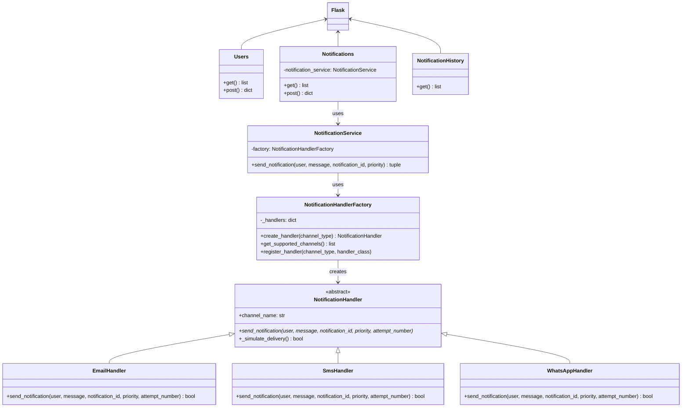

# Sistema de Notificaciones con Factory Method

**Autor:** Maria Paula Carvajal Martinez  
**Email:** marcarvajalma@unal.edu.co  

## Descripción del Sistema

Este sistema implementa una API REST desarrollada con Flask que gestiona la entrega de notificaciones utilizando el patrón de diseño **Factory Method**. El sistema permite registrar usuarios con sus preferencias de comunicación y enviar notificaciones con mecanismos de respaldo automático, manteniendo un historial completo de todos los intentos de entrega.


## Arquitectura y Patrones de Diseño

### Patrón Factory Method

El sistema implementa el patrón Factory Method para crear handlers de notificación de manera dinámica:

```
NotificationHandlerFactory
├── create_handler("email") → EmailHandler
├── create_handler("sms") → SmsHandler
└── create_handler("whatsapp") → WhatsAppHandler
```

#### Justificación del Patrón

El uso del patrón Factory en la creación de handlers permite centralizar la lógica de instanciación, desacoplando al cliente de las clases concretas y facilitando la extensibilidad del sistema, ya que se pueden agregar nuevos handlers sin modificar el código existente. Gracias al polimorfismo, todos los handlers comparten una misma interfaz, lo que mejora la mantenibilidad del código y permite que cada handler sea independiente. Además, los handlers pueden configurarse dinámicamente en tiempo de ejecución, cumpliendo con el principio abierto/cerrado al estar abiertos a la extensión sin necesidad de alterar su estructura base.

### Diagrama de Clases/Módulos



### Estructura del Proyecto

```
factory_method_notifications/
├── api.py                 # Aplicación principal con Factory Method
├── README.md             # Este archivo
└── requirements.txt      # Dependencias
```

## Documentación de Endpoints

### Base URL
```
http://localhost:5000
```

### 1. Gestión de Usuarios

#### `GET /users/`
Obtiene todos los usuarios registrados.

**Respuesta:**
```json
[
  {
    "id": 1,
    "name": "Juan Pérez",
    "preferred_channel": "email",
    "available_channels": ["email", "sms", "whatsapp"]
  }
]
```

#### `POST /users/`
Crea un nuevo usuario.

**Cuerpo de la petición:**
```json
{
  "name": "María García",
  "preferred_channel": "email",
  "available_channels": ["email", "sms", "whatsapp"]
}
```

**Validaciones:**
- Canal preferido debe estar en `["email", "sms", "whatsapp"]`
- Canales disponibles deben ser una lista válida
- Canal preferido debe estar incluido en canales disponibles
- No debe haber duplicados en canales disponibles

### 2. Sistema de Notificaciones

#### `GET /notifications/send`
Obtiene todas las notificaciones enviadas.

**Respuesta:**
```json
[
  {
    "id": 1,
    "user_name": "María García",
    "message": "Su pedido ha sido enviado",
    "priority": "medium",
    "delivered_via": "sms",
    "timestamp": "2025-05-30T10:30:00",
    "total_attempts": 2,
    "success": true
  }
]
```

#### `POST /notifications/send`
Envía una notificación a un usuario utilizando el Factory Method.

**Cuerpo de la petición:**
```json
{
  "user_name": "María García",
  "message": "Su pedido ha sido enviado",
  "priority": "medium"
}
```

**Valores válidos para priority:** `high`, `medium`, `low`

**Proceso interno:**
1. El `NotificationService` identifica los canales del usuario
2. Para cada canal, usa `NotificationHandlerFactory.create_handler()`
3. Intenta entrega con el handler creado dinámicamente
4. Si falla, crea el handler del siguiente canal
5. Registra cada intento en el historial

### 3. Historial de Notificaciones

#### `GET /notifications/history`
Obtiene el historial completo de intentos de entrega.

**Respuesta:**
```json
[
  {
    "id": 1,
    "notification_id": 1,
    "user_name": "María García",
    "message": "Su pedido ha sido enviado",
    "priority": "medium",
    "channel": "email",
    "success": false,
    "timestamp": "2025-05-30T10:30:00",
    "attempt_number": 1
  },
  {
    "id": 2,
    "notification_id": 1,
    "user_name": "María García",
    "message": "Su pedido ha sido enviado",
    "priority": "medium",
    "channel": "sms",
    "success": true,
    "timestamp": "2025-05-30T10:30:05",
    "attempt_number": 2
  }
]
```

## Instalación y Configuración

### Requisitos Previos
- Python 3.7 o superior
- pip (gestor de paquetes de Python)

### Instalación

1. **Clonar o descargar el código:**
```bash
# Si tienes el archivo
cp api.py ./factory-method-notifications/
cd factory-method-notifications
```

2. **Instalar dependencias:**
```bash
pip install flask flask-restful flasgger
```

3. **Ejecutar la aplicación:**
```bash
python api.py
```

4. **Acceder a la documentación:**
- API Principal: http://localhost:5000/
- Swagger UI: http://localhost:5000/swagger/ (si está configurado)

## Ejemplos de Uso

### Usando cURL

#### 1. Crear un usuario
```bash
curl -X POST "http://localhost:5000/users/" \
-H "Content-Type: application/json" \
-d '{
  "name": "Ana López",
  "preferred_channel": "email",
  "available_channels": ["email", "sms", "whatsapp"]
}'
```

#### 2. Enviar una notificación
```bash
curl -X POST "http://localhost:5000/notifications/send" \
-H "Content-Type: application/json" \
-d '{
  "user_name": "Ana López",
  "message": "Bienvenida al sistema",
  "priority": "high"
}'
```

#### 3. Ver historial de entregas
```bash
curl -X GET "http://localhost:5000/notifications/history"
```

#### 4. Listar todos los usuarios
```bash
curl -X GET "http://localhost:5000/users/"
```

### Usando Postman

#### Configuración Base
1. **Base URL:** `http://localhost:5000`
2. **Headers:** `Content-Type: application/json`

#### Colección de Pruebas

**1. Crear Usuario**
- **Método:** POST
- **URL:** `/users/`
- **Body (JSON):**
```json
{
  "name": "Carlos Mendoza",
  "preferred_channel": "sms",
  "available_channels": ["email", "sms"]
}
```

**2. Listar Usuarios**
- **Método:** GET
- **URL:** `/users/`

**3. Enviar Notificación**
- **Método:** POST
- **URL:** `/notifications/send`
- **Body (JSON):**
```json
{
  "user_name": "Carlos Mendoza",
  "message": "Recordatorio de pago",
  "priority": "high"
}
```

**4. Ver Historial**
- **Método:** GET
- **URL:** `/notifications/history`

**5. Ver Notificaciones Enviadas**
- **Método:** GET
- **URL:** `/notifications/send`

## Flujo de Funcionamiento con Factory Method

### Proceso de Entrega de Notificaciones

1. **Recepción de solicitud** de envío de notificación
2. **Búsqueda del usuario** por nombre
3. **Construcción de la lista** de canales a intentar:
   - Primero: Canal preferido del usuario
   - Después: Otros canales disponibles
4. **Ejecución con Factory Method**:
   - Para cada canal: `factory.create_handler(channel_type)`
   - El handler creado intenta la entrega
   - Si falla, se crea el handler del siguiente canal
   - Se registra cada intento en el historial
5. **Finalización**:
   - Éxito: Se registra la notificación como entregada
   - Fallo: Se registra como fallida tras agotar todos los canales

### Ejemplo de Flujo

```
Usuario: Juan (preferido: email, disponible: [email, sms, whatsapp])
Mensaje: "Confirmación de pedido"

Intento 1: Factory.create_handler("email") → EmailHandler
├── EmailHandler.send_notification()
├── Resultado: FALLO
└── Registra: attempt #1, email, failed

Intento 2: Factory.create_handler("sms") → SmsHandler  
├── SmsHandler.send_notification()
├── Resultado: ÉXITO
├── Registra: attempt #2, sms, success
└── FINALIZA: Notificación entregada via SMS
```

